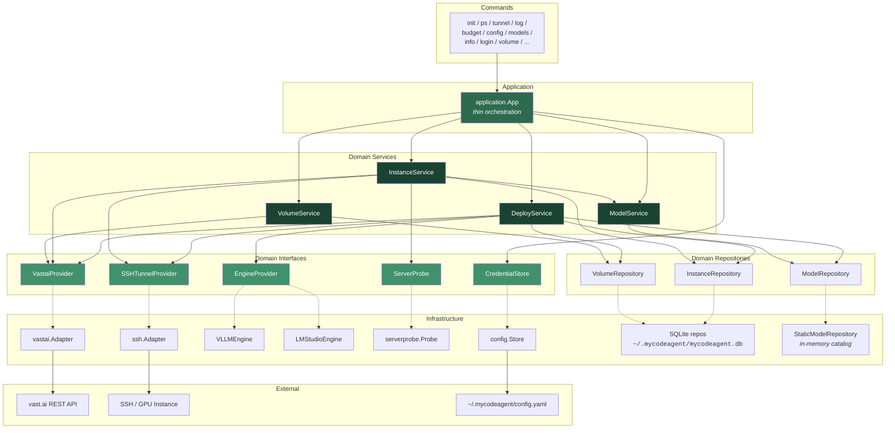
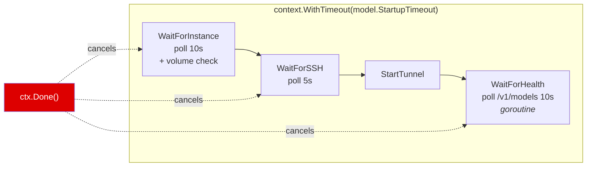
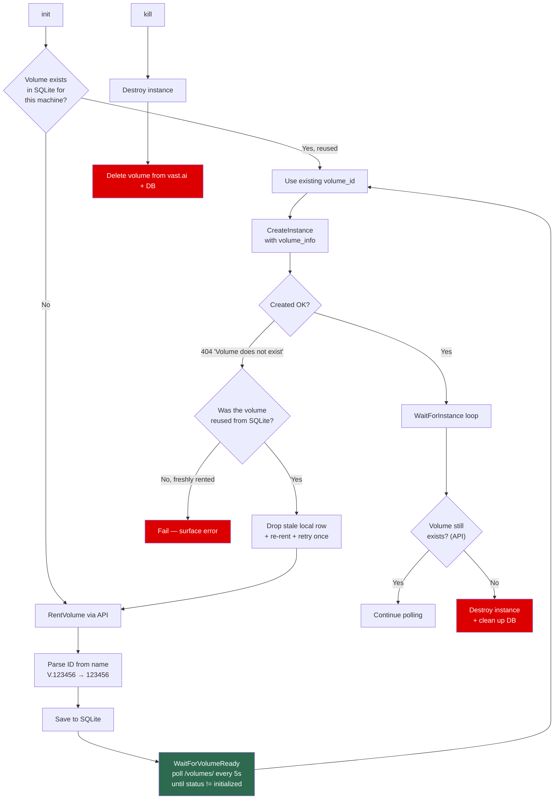
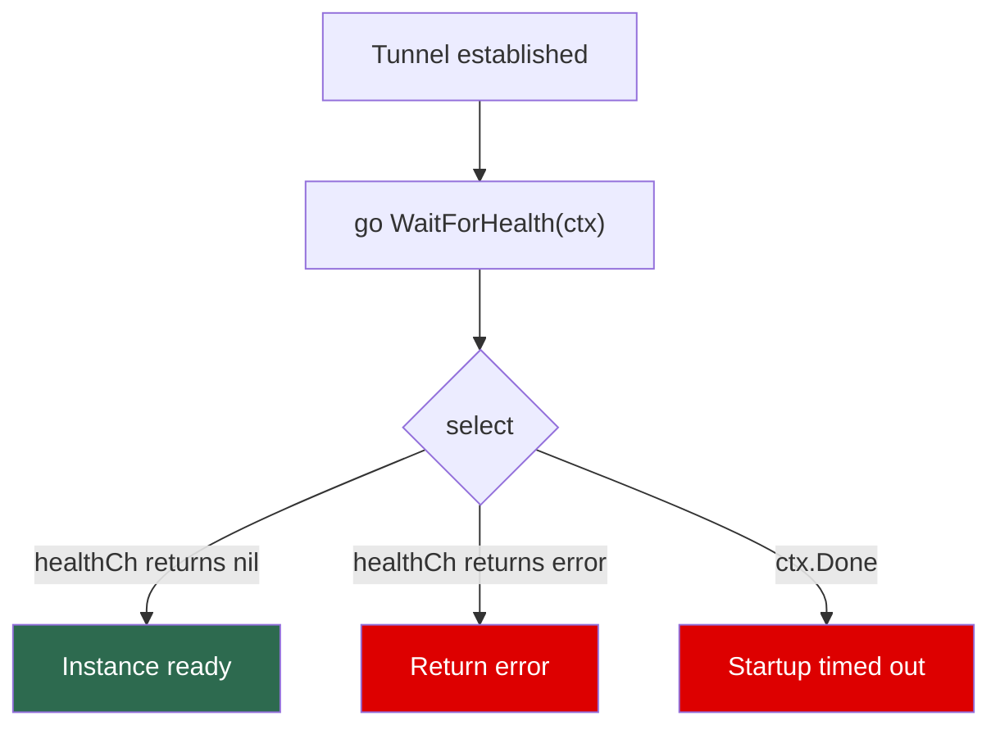
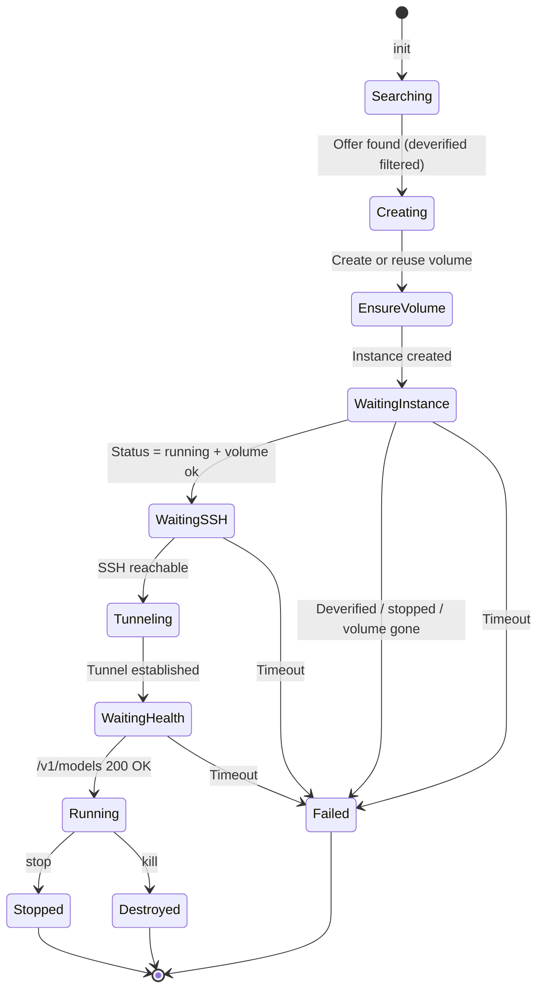
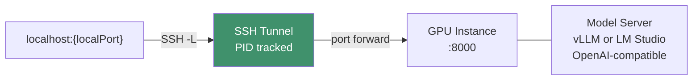

# Solution: Instance Deployment Logic

## Overview

`mycodeagent init <model>` deploys a model on a vast.ai GPU instance and exposes it as an OpenAI-compatible API on localhost. Models can run via **vLLM** or **LM Studio** engines. The entire startup is governed by a single `context.Context` with a per-model timeout (default 10 min, up to 20 min for multi-GPU models).

## Architecture Layers

The codebase follows a strict Clean Architecture layering enforced by code review and `grep` checks:

```
commands → application.App → domain/service → domain/repository
                                    ↓
                       infrastructure (adapters)
```

### The rules

1. **Commands** import only `internal/application` and `internal/domain/entity`. They never touch infrastructure (no `vastai.Client`, no `ssh.Adapter`, no `persistence.OpenDB`). Each command's `RunE` calls one or more methods on `*application.App` and formats the result.
2. **`application.App`** holds service references and orchestrates use cases. It never imports any package under `internal/infrastructure/`, never calls a repository directly, never constructs an infrastructure client. Persisting credentials goes through the `service.CredentialStore` domain interface, not `config.Save()`. Read access to credentials is via `app.VastaiAPIKey()` and `app.HFToken()` accessors.
3. **Domain services** (`internal/domain/service/`) own all business logic. They depend only on repository interfaces (`domain/repository`) and provider interfaces (`VastaiProvider`, `SSHTunnelProvider`, `EngineProvider`, `ServerProbe`, `CredentialStore`) — all defined in the `service` package itself. Services accept `context.Context` as the first argument on every public method.
4. **Domain repositories** are interface-only. The implementations live under `internal/infrastructure/persistence/`.
5. **Infrastructure** is the only layer allowed to import third-party clients (`vastai.Client`, sqlite drivers, llama.cpp adapters, etc.) and is responsible for translating between raw client types and domain DTOs (`service.RemoteInstance`, `entity.Instance`, etc.).

`go build ./...` plus three grep checks enforce the rules:

```bash
grep -r 'internal/infrastructure/' cmd/mycodeagent/commands/   # must be empty
grep -rn 'persistence\.\|sqlite\.'  internal/application/      # must be empty
grep -rn 'OpenDB\|NewSQLite\|NewStaticModelRepository' internal/application/   # must be empty
```

### Layer diagram



Solid arrows are concrete dependencies (struct fields). Dashed arrows are interface-implementation relationships — the `service` package only sees the interface; the `infrastructure` package provides the implementation, wired in `cmd/mycodeagent/main.go` (the composition root).

### Application orchestration

`application.App` is intentionally thin. Most methods are one-line delegations:

```go
func (app *App) Deploy(ctx context.Context, modelName string, noVolume bool) (*entity.Instance, error) {
    return app.DeploySvc.Deploy(ctx, modelName, noVolume)
}

func (app *App) SyncInstances(ctx context.Context) ([]*entity.Instance, error) {
    return app.InstanceSvc.Sync(ctx)
}

func (app *App) GetServedModelInfo(ctx context.Context, localPort int) (string, int, error) {
    return app.InstanceSvc.GetServedModelInfo(ctx, localPort)
}
```

A few are multi-step orchestrations:

```go
// Stop kills the SSH tunnel after the vast.ai stop completes — two services
// composed in one use-case method.
func (app *App) Stop(ctx context.Context, id int64) error {
    if err := app.DeploySvc.Stop(ctx, id); err != nil {
        return err
    }
    return app.InstanceSvc.StopTunnel(ctx, id)
}

// Login verifies the new vast.ai key, optionally uploads an SSH key, then
// persists credentials via the CredentialStore — three service calls.
func (app *App) Login(ctx context.Context, in LoginInput) (*LoginResult, error) { ... }
```

App **never** opens the SQLite DB, **never** calls `repository.*` directly, and **never** constructs an infrastructure client. Every operation that touches state goes through a service.

### Domain services

| Service | Owns | Depends on |
|---|---|---|
| **`DeployService`** | The full `init` flow: search → create → wait → tunnel → save. Also `Stop`, `Destroy`, `Restart`. | `InstanceRepository`, `VolumeRepository`, `ModelRepository`, `VastaiProvider`, `SSHTunnelProvider`, `map[ModelEngine]EngineProvider`, basePort, hfToken |
| **`InstanceService`** | Read/write/orchestration over instances: CRUD, `Sync` (pull from vast.ai + reconcile), `EstablishTunnel` (re-attach to a running instance), `GetVastaiLogs`, `GetServedModelInfo`, `GetBudget`, credential operations (`VerifyVastaiKey`, `UploadSSHKey`). | `InstanceRepository`, `VastaiProvider`, `SSHTunnelProvider`, `ServerProbe`, `*ModelService`, basePort |
| **`VolumeService`** | Volume lifecycle: `Create`, `List`, `Delete`. | `VolumeRepository`, `VastaiProvider` |
| **`ModelService`** | Static model catalog lookups: `List`, `FindByName`, `FindByAlias`. No `ctx` because the static repo has no I/O. | `ModelRepository` |

### Provider interfaces

All interfaces live in `internal/domain/service/` so the domain layer never imports infrastructure types:

| Interface | Purpose | Implementation |
|---|---|---|
| **`VastaiProvider`** | Vast.ai REST: search offers, create/wait/destroy instances, volume CRUD, instance read access (`GetInstance`, `ListRemoteInstances`, `GetInstanceLogs`), credential operations (`VerifyAPIKey`, `ListSSHKeys`, `CreateSSHKey`). Returns `service.RemoteInstance` DTOs, never raw `vastai.InstanceInfo`. | `vastai.Adapter` (`internal/infrastructure/vastai/adapter.go`) |
| **`SSHTunnelProvider`** | SSH operations: `StartTunnel`, `StopTunnel`, `WaitForSSH`, `FindFreePort`, `RunRemoteCommand`, `WaitForVLLMHealth`. | `ssh.Adapter` (`internal/infrastructure/ssh/adapter.go`) |
| **`EngineProvider`** | Engine-specific deploy details (Docker image, onstart script, restart commands). Selected per-model via `model.Engine`. | `engine.VLLMEngine`, `engine.LMStudioEngine` |
| **`ServerProbe`** | Localhost `/v1/models` HTTP probe used to read served model id and `max_model_len` from a running instance. Best-effort: returns `("", 0, nil)` on failure. | `serverprobe.Probe` (`internal/infrastructure/serverprobe/probe.go`) |
| **`CredentialStore`** | One-method interface for persisting vast.ai key + HF token. Used only by `App.Login`. | `config.Store` (`internal/infrastructure/config/store.go`) |

### Engine Provider Pattern

The `EngineProvider` interface abstracts engine-specific deployment details. The actual signature lives in `internal/domain/service/deploy_service.go`:

```go
type EngineProvider interface {
    DockerImage() string
    // numGPUs and contextLength come from the selected offer and the scaled
    // context computed by DeployService — they override anything in the model
    // definition so the search filter and the launched server stay in sync.
    BuildOnstart(model *entity.Model, numGPUs, contextLength int, hfToken string) string
    BuildRawCommand(model *entity.Model, numGPUs, contextLength int) string
    VolumeMountPath() string
    RestartCommands(model *entity.Model) (killCmd string, startCmd string)
}
```

Two implementations:

| Engine | Docker Image | Model Format | Server Port |
|---|---|---|---|
| **VLLMEngine** | `vllm/vllm-openai:v0.19.0` | HuggingFace (AWQ / FP16 / FP8) | 8000 |
| **LMStudioEngine** | `nvidia/cuda:12.4.1-runtime-ubuntu22.04` | GGUF via `lms get` | 8000 |

`DeployService` picks the engine via `engineFor(model)`, defaulting to `EngineVLLM` when `model.Engine` is unset.

## Deploy Flow

```mermaid
sequenceDiagram
    participant User
    participant CLI
    participant App as application.App
    participant DeployService
    participant EngineProvider
    participant VastaiProvider
    participant SSHTunnelProvider
    participant VastAI as vast.ai API
    participant Remote as GPU Instance

    User->>CLI: mycodeagent init <model>
    CLI->>App: app.Deploy(ctx, modelName, noVolume)
    App->>DeployService: Deploy(ctx, modelName, noVolume)

    Note over DeployService: Wraps ctx with<br/>model.StartupTimeout

    DeployService->>DeployService: Resolve model profile
    DeployService->>EngineProvider: BuildOnstart(model, numGPUs, ctxLen, hfToken)
    EngineProvider-->>DeployService: onstart script
    DeployService->>VastaiProvider: SearchOffers(VRAM, numGPUs)
    VastaiProvider->>VastAI: GET /bundles (search, filter deverified)
    VastAI-->>VastaiProvider: Sorted offers
    VastaiProvider-->>DeployService: Cheapest offer

    DeployService->>DeployService: ensureVolume(ctx, offer, mountPath)
    alt New volume
        DeployService->>VastaiProvider: RentVolume(askID, sizeGB)
        VastaiProvider->>VastAI: PUT /volumes/
        VastAI-->>VastaiProvider: volume_name
        DeployService->>VastaiProvider: WaitForVolumeReady(ctx, volumeID)
        loop Poll /volumes/ every 5s
            VastaiProvider->>VastAI: GET /volumes/
            Note over VastaiProvider: until status != "initialized"
        end
    else Reused from SQLite
        Note over DeployService: trust local row, no API call
    end
    DeployService->>VastaiProvider: CreateInstance(offerID, image, env, onstart, volumeID)
    VastaiProvider->>VastAI: PUT /asks/{id}
    alt 404 "Volume X does not exist" AND volume was reused
        Note over DeployService: stale local row — drop it,<br/>re-rent + WaitForVolumeReady, retry once
    end
    VastAI-->>VastaiProvider: instanceID
    VastaiProvider-->>DeployService: instanceID

    rect rgb(50, 50, 80)
        Note over DeployService,Remote: All waits share one context (timeout)
        DeployService->>VastaiProvider: WaitForInstance(ctx, instanceID, volumeID)
        loop Poll every 10s until "running"
            VastaiProvider->>VastAI: GET /instances/{id}
            Note over VastaiProvider: Check: deverified? stopped?<br/>volume still exists?
            VastAI-->>VastaiProvider: status + volume check
        end
        VastaiProvider-->>DeployService: sshHost, sshPort, rate

        DeployService->>SSHTunnelProvider: WaitForSSH(ctx, host, port)
        loop Dial TCP every 5s
            SSHTunnelProvider->>Remote: TCP connect
        end
        SSHTunnelProvider-->>DeployService: SSH ready

        DeployService->>SSHTunnelProvider: FindFreePort(basePort)
        SSHTunnelProvider-->>DeployService: localPort

        DeployService->>SSHTunnelProvider: StartTunnel(localPort, host, port)
        SSHTunnelProvider-->>DeployService: tunnelPID

        DeployService->>SSHTunnelProvider: WaitForHealth(ctx, localPort)
        Note over SSHTunnelProvider: Runs in goroutine
        loop GET /v1/models every 10s
            SSHTunnelProvider->>Remote: HTTP localhost:localPort/v1/models
        end
        SSHTunnelProvider-->>DeployService: Healthy (or ctx timeout)
    end

    DeployService->>DeployService: Save instance to SQLite
    DeployService-->>App: Instance
    App-->>CLI: Instance
    CLI-->>User: API available at localhost:{port}/v1
```



## Timeout Strategy

A single `context.WithTimeout` wraps the entire startup sequence. Each wait phase consumes from the same deadline -- if an earlier phase is slow, later phases have less time, and the whole flow fails cleanly on expiry.



### Per-Model Timeouts

| Model | Alias | Engine | GPUs | Context (base → max) | Timeout |
|---|---|---|---|---|---|
| `qwen3-5-35b-a3b-awq` | `coder` | vLLM | 2× ≥32 GB | 131k → 262k | 25 min |
| `qwen3-vl-32b-instruct-fp8` | `coder_vl` | vLLM | 2× ≥24 GB | 32k → 131k | 15 min |
| `qwen25-32b-instruct-awq` | `writer` | vLLM | 2× ≥24 GB | 32k → 131k | 15 min |
| `dolphin-glm-24b-gguf` | `rude` | LM Studio | 2× ≥24 GB | 65k → 131k | 15 min |
| `qwen3-5-35b-a3b-gguf` | `coder-2` | LM Studio | 2× ≥24 GB | 131k → 262k | 15 min |

Bigger models (multi-GPU MoE, larger downloads) get longer timeouts. If `StartupTimeout` is unset, the default is **10 minutes**. The context's "max" column is the cap that `scaledContextLength` will grow toward when the rented offer has fatter GPUs than the catalog minimum (see `internal/domain/service/deploy_service.go`).

## Volume Management

Volumes provide persistent storage for model caching across instance restarts.



- Volumes are created per-machine and tracked in SQLite (`volume_id` on instance)
- New volumes start in vast.ai's `initialized` state — `CreateInstance` rejects them with a misleading 404 `"Volume X does not exist"` until the status transitions, so `ensureVolume` blocks on `WaitForVolumeReady` after every fresh `RentVolume`
- The 404-on-`CreateInstance` retry only fires when the volume came from a **reused** SQLite row (a freshly rented volume has already been verified ready, so a 404 there indicates a real failure, not staleness — retrying would just orphan more volumes)
- `volume list` calls `GET /api/v0/volumes/` and removes stale local records
- `kill` destroys both the instance and its associated volume
- During `WaitForInstance`, volume existence is verified on each poll; if gone, instance is destroyed

## Health Check

The health check polls `GET /v1/models` (works for both vLLM and LM Studio) in a background goroutine:



## Instance Lifecycle



## SSH Tunnel Detail



- Each `init` allocates a new local port (starting from `basePort`, scanning +100)
- Tunnel runs as a background `ssh -N -L` process; PID saved to SQLite
- `stop` sends SIGTERM to the tunnel PID, then stops the vast.ai instance
- `kill` destroys the instance, its tunnel, and associated volume
- `restart` regenerates the onstart script on the instance and restarts the server

## vLLM Parameters Reference

The `VLLMEngine` builds the `vllm serve` command in `internal/infrastructure/engine/vllm.go`. Two flags are always emitted by the engine itself and cannot be set in the catalog (they would be stripped by `stripFlagPair`):

- `--tensor-parallel-size <NumGPUs>` — comes from the actual vast.ai offer's GPU count, not from `model.NumGPUs` directly. Catalog `NumGPUs` is only the search-filter minimum; the rented offer may have more.
- `--max-model-len <ContextLength>` — comes from `scaledContextLength()`, which grows `model.ContextLength` linearly with per-GPU VRAM headroom over `model.VRAM`, capped at `model.MaxContextLength`.

Everything else is supplied by `model.VLLMArgs` in `internal/infrastructure/persistence/model_repo_static.go`. Below are the flags we use, plus the next-most-likely candidates if a model needs tuning.

### Currently used in the catalog

| Flag | Purpose | Notes |
|---|---|---|
| `--quantization <method>` | Force a specific quant kernel: `awq`, `awq_marlin`, `gptq_marlin`, `fp8`, `bitsandbytes`, … | **Usually omit.** For AWQ models on Ampere+ GPUs vLLM's auto-detect already promotes to `awq_marlin` (1.5–2× faster than plain `awq`); see `AWQMarlinConfig.is_awq_marlin_compatible` and the per-layer fallback in `get_quant_method`. **Setting `--quantization awq` is a perf footgun** because it blocks the Marlin upgrade. Force `awq_marlin` explicitly only when (a) the model card omits `bits`/`group_size`/`zero_point` and auto-detect can't upgrade, or (b) you want startup to fail loudly if Marlin isn't picked. MoE AWQ models also use Marlin via `AWQMarlinMoEMethod` — auto-detect handles it correctly. |
| `--dtype <type>` | Model compute dtype: `auto`, `half`/`float16`, `bfloat16`, `float`, `float32` | Almost always leave as `auto`. We pin `half` on the dense AWQ models because some Ampere kernels need fp16, not bf16. Don't set for FP8/MoE models. |
| `--gpu-memory-utilization <0..1>` | Fraction of each GPU's VRAM vLLM may use for weights + KV + activations + CUDA graphs. Default `0.9` | Lower it (`0.85`) if you're sharing the GPU or hitting OOM during CUDA graph capture. Raise it (`0.95`) on dedicated boxes when KV is the bottleneck. |
| ~~`--swap-space <GB>`~~ | **Removed in v1 engine (v0.19.0).** Used to control CPU RAM for KV block swap under preemption. | Do not pass — `vllm serve` errors with "unrecognized arguments: --swap-space". Old model cards (including the QuantTrio Qwen3.5 launch line) still show it. V1 replacements are `--kv-cache-memory-bytes` (manual KV sizing) and `--cpu-offload-gb` (weight offload), both conceptually different. |
| `--enable-prefix-caching` | Reuse KV cache across requests sharing a prompt prefix | Free latency win for agentic workloads (system prompt + tool definitions never change). On by default in v1 — keeping the flag is harmless and explicit. |
| `--enable-auto-tool-choice` | Lets the server emit OpenAI-style `tool_calls` when the model produces them | Required for any tool-calling client (opencode, OpenAI SDK with `tools=`). Pair with `--tool-call-parser`. |
| `--tool-call-parser <name>` | Picks the parser that recognizes the model's tool-call format. Catalog uses: `hermes` (Qwen2.5), `qwen3_xml` (Qwen3-Coder family, including Qwen3.5-A3B — this is the one listed in vLLM's official `tool_calling.md`). | Note: `qwen3_coder` also exists in v0.19.0 source and scans the same `<tool_call>`/`<function=>` XML tokens, but it isn't mentioned in the docs — prefer `qwen3_xml`. Other registered names: `mistral`, `llama3_json`, `llama4_pythonic`, `glm4_moe`, `kimi_k2`, `deepseekv3`/`v31`/`v32`, `granite`, `internlm2`, `jamba`, `pythonic`, `phi4_mini_json`. Wrong parser → tool calls leak as plain text. |
| `--reasoning-parser <name>` | Strips `<think>…</think>` blocks from generation into a separate `reasoning_content` field | Registered in v0.19.0: `qwen3`, `deepseek_r1`, `mistral`, `granite`. Without it the client sees raw `<think>` tokens in the response. |
| `--enable-expert-parallel` | Activates expert-parallel for MoE models — experts are sharded across TP ranks rather than replicated | **Required for large MoE models that don't fit replicated.** For Qwen3.5-35B-A3B: weights are 25 GiB; with TP=2 and EP enabled each GPU holds half the experts (~12.5 GiB). Without it, every rank holds all experts. |
| `--trust-remote-code` | Allow loading custom modeling code from the HF repo | Needed for any model whose `config.json` references custom Python (Qwen-VL, some MoE variants). Harmless on standard models. |

### Likely-needed for tuning (not currently in any catalog row)

| Flag | Purpose | When to reach for it |
|---|---|---|
| `--max-num-seqs <N>` | Hard cap on concurrent sequences in a batch. Default 256 | Lower (`8`–`32`) when KV cache memory is the bottleneck — frees KV blocks for longer sequences instead of more parallel ones. The QuantTrio model card uses `32` for 35B. |
| `--max-num-batched-tokens <N>` | Hard cap on tokens-per-step across the whole batch | Tune up for throughput on bigger boxes; tune down for latency-sensitive single-user setups. |
| `--kv-cache-dtype <type>` | KV cache storage dtype: `auto`, `fp8`, `fp8_e4m3`, `fp8_e5m2`, `bfloat16` | **Halves KV memory** when set to `fp8`. Free way to roughly double maximum context on the same GPU, with negligible quality loss for most models. First thing to try if 130k doesn't fit. |
| `--block-size <N>` | KV cache block size in tokens (`8`/`16`/`32`/`64`/`128`/`256`) | Larger blocks = less fragmentation but coarser allocation. Default is platform-picked; touch only when profiling shows fragmentation issues. |
| `--rope-scaling '<json>'` | Apply RoPE scaling (YaRN, linear, dynamic, longrope) at load time to extend context past the model's native max | Needed for Qwen2.5 dense to reach 128k from native 32k: `'{"rope_type":"yarn","factor":4.0,"original_max_position_embeddings":32768}'`. **Not** needed for Qwen3.5-A3B (native 262k). |
| `--enforce-eager` | Skip CUDA graph capture entirely | Cuts ~30–60s off startup at the cost of ~10–20% throughput. Useful for fast iteration when you're debugging a deploy. |
| `--served-model-name <alias>` | Override the model id reported by `/v1/models` and accepted in chat/completion requests | Set to a short alias (e.g. `coder`) so opencode model keys don't have to be the long HF repo name. Could be wired through from `model.Alias`. |
| `--cpu-offload-gb <GB>` | Offload N GB of weights per GPU to CPU RAM | Last-resort knob for fitting weights when `--quantization` and `--tensor-parallel-size` aren't enough. Big throughput hit. |
| `--max-num-batched-tokens` + `--max-num-seqs` together | Tune the scheduler's batch shape | The two interact — `max-num-batched-tokens / max-num-seqs ≈ avg seq len per step`. |
| `--speculative-config '<json>'` | Enable speculative decoding with a draft model or MTP head | Big latency win when supported. The QuantTrio Qwen3.5 card suggests `'{"method":"qwen3_next_mtp","num_speculative_tokens":2}'` but only if a paired MTP draft is available. |
| `--api-key <key>` | Require an `Authorization: Bearer <key>` header | Worth adding once we expose tunnels beyond localhost. |
| `--disable-log-requests` | Suppress per-request logs | Quieter `vllm.log`; useful in steady-state. |

### Always set by the engine (do not put in catalog)

| Flag | Source |
|---|---|
| `--host 0.0.0.0` | hardcoded in `vllm.go:65` |
| `--port 8000` | hardcoded; the SSH tunnel maps `localPort → 8000` on the remote |
| `--tensor-parallel-size <N>` | from `offer.NumGPUs` (actual rented count) |
| `--max-model-len <N>` | from `scaledContextLength(model, offer.GPUMemory)` |

If you put either of the last two in `VLLMArgs`, `stripFlagPair` removes them so the runtime values stay the single source of truth.

### Optimal params per model in our catalog

These are the *intentional* choices for each model — not just a list of what's set, but **why**.

#### `qwen3-5-35b-a3b-awq` (alias `coder`) — Qwen3.5-35B-A3B-AWQ on vLLM

MoE: 35B total, 3B active per token. ~25 GiB AWQ weights. Native 262k context.

| Flag | Value | Why |
|---|---|---|
| `--quantization` | *(omitted)* | Auto-detect upgrades to `awq_marlin` for both linear and `FusedMoE` layers via `AWQMarlinMoEMethod`. Forcing it would be redundant. |
| `--enable-expert-parallel` | (set) | **Required at TP=2** — without it, every rank replicates all experts and weights don't fit. With it, experts are sharded across ranks (~12.5 GiB/GPU). |
| ~~`--swap-space`~~ | *(removed)* | The QuantTrio launch example includes `--swap-space 16`, but it's **invalid in vLLM v0.19.0** — the v1 engine dropped the flag and `vllm serve` errors out with "unrecognized arguments". Confirmed by an actual deploy failure on instance 25. |
| `--gpu-memory-utilization` | `0.90` | Balance between KV headroom and CUDA-graph capture room. 0.95 risks OOM during graph capture on the 25 GiB weight footprint. |
| `--enable-prefix-caching` | (set) | Reuses KV across requests sharing the system prompt + tool schema — big latency win for agent loops. Default-on in v1, kept explicit for clarity. |
| `--enable-auto-tool-choice` + `--tool-call-parser qwen3_xml` | (set) | Required pair so opencode receives `tool_calls` instead of raw tags. `qwen3_xml` is the parser vLLM's `tool_calling.md` docs list for the Qwen3-Coder family; the `qwen3_coder` parser also exists in source but isn't documented. Both scan the same `<tool_call>/<function=>` XML tokens, so the choice doesn't affect what formats are recognized — just streaming/edge-case handling. |
| `--reasoning-parser qwen3` | (set) | Strips `<think>…</think>` into `reasoning_content` so chat clients don't render the thinking trace as the answer. |
| `--trust-remote-code` | (set) | Required for Qwen MoE custom modeling code. |
| **Tuning candidates if 130k doesn't fit** | `--kv-cache-dtype fp8` (halves KV mem) → `--max-num-seqs 8` (frees blocks) → bump `NumGPUs` to 4 in catalog | In that order. |

#### `qwen25-32b-instruct-awq` (alias `writer`) — Qwen2.5-32B-Instruct-AWQ on vLLM

Dense 32B AWQ. ~9 GiB weights. Native 32k context, extendable to 128k via YaRN.

| Flag | Value | Why |
|---|---|---|
| `--quantization` | *(omitted, was `awq` — fixed)* | Forcing plain `awq` blocked the auto Marlin upgrade. Now auto-detects `awq_marlin` on every Ampere+ rental. |
| `--dtype half` | (set) | Some Ampere AWQ kernels need fp16, not bf16. Pin it. |
| `--gpu-memory-utilization` | `0.95` | Dense 9 GiB weights leave plenty of room — push KV cache as high as possible since this is the writer (single user, long generations). |
| `--enable-prefix-caching` | (set, added) | Was missing — free win for the writer's repeating system prompt. |
| **Recommended add** | `--rope-scaling '{"rope_type":"yarn","factor":4.0,"original_max_position_embeddings":32768}'` for long-form writing | Only if you actually use >32k. Triggers when `MaxContextLength: 131072` and the offer scales context past 32k. |

#### `qwen3-vl-32b-instruct-fp8` (alias `coder_vl`) — Qwen3-VL-32B-Instruct-FP8 on vLLM

Dense 32B vision-language, FP8 quant.

| Flag | Value | Why |
|---|---|---|
| `--quantization` | *(omitted)* | FP8 is declared in `config.json`; setting `--quantization fp8` is redundant and can conflict with the model's native FP8 layout. |
| `--dtype` | *(omitted)* | FP8 models pick their own compute dtype. Don't override. |
| `--gpu-memory-utilization` | `0.90` | Vision activations are bigger than text-only — leave headroom. |
| `--trust-remote-code` | (set) | Qwen-VL ships custom processor code. |
| **Recommended add** | `--limit-mm-per-prompt '{"image":4}'` and lower `--max-num-seqs 16` | Caps vision input cost per request and prevents the scheduler from packing too many vision sequences (each holds large mm activations). |

#### `dolphin-glm-24b-gguf` and `qwen3-5-35b-a3b-gguf` — LM Studio engine

These do **not** run on vLLM, so this section doesn't apply. Their flags are managed by `LMStudioEngine` and the `lms` CLI; the relevant knobs are GGUF quant level (Q4_K_M, Q5_K_M, …) and `--context-length` on `lms load`.

### General tuning order when something is wrong

Use this as a decision tree, top to bottom:

1. **OOM during weight load** → bump `NumGPUs` in the catalog (more shards) before touching anything else.
2. **OOM during CUDA graph capture** → drop `--gpu-memory-utilization` from 0.95 → 0.90 → 0.85.
3. **OOM "KV cache too small for max_model_len"** → add `--kv-cache-dtype fp8` (halves KV) → drop `--max-num-seqs` to 8 or 16 → drop `ContextLength` in the catalog.
4. **Slow first token / agent loop** → confirm `--enable-prefix-caching` is on; check `vllm.log` for `awq_marlin` (not plain `awq`) being picked.
5. **Tool calls leak as plain text** → wrong `--tool-call-parser` for the model family.
6. **`<think>…</think>` showing in chat** → missing `--reasoning-parser`.
7. **Startup hangs at "Capturing CUDA graphs"** → it's not hung, it just takes 30–90s. If you're iterating, add `--enforce-eager` to skip it entirely.

### Reference

- Full vLLM CLI: `vllm serve --help` inside the container, or https://docs.vllm.ai/en/latest/cli/serve
- Engine config classes (source of truth for defaults): `vllm/config/cache.py`, `vllm/config/scheduler.py`, `vllm/config/parallel.py`
- Quantization auto-detect logic: `vllm/model_executor/layers/quantization/awq_marlin.py` (`is_awq_marlin_compatible`, `get_quant_method`)
- Registered tool parsers in v0.19.0: `vllm/tool_parsers/__init__.py`
- Registered reasoning parsers in v0.19.0: `vllm/reasoning/__init__.py`
