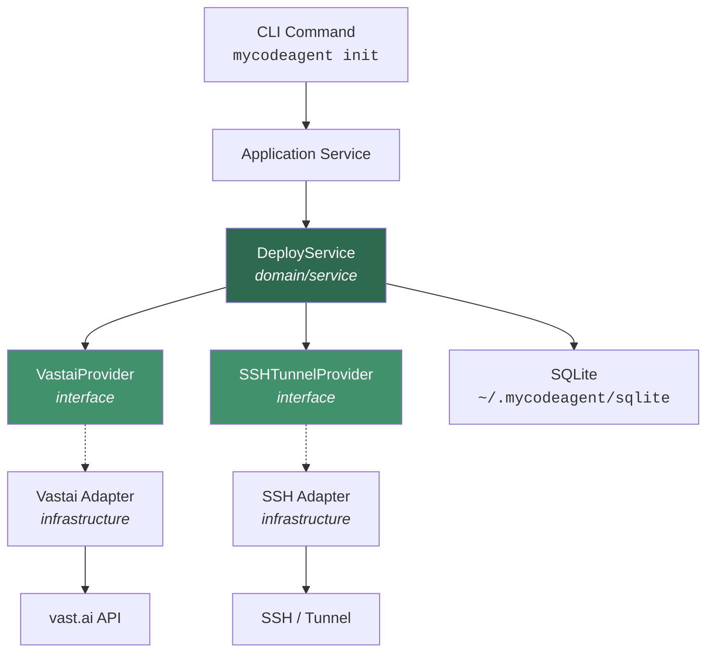
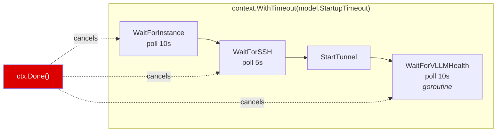
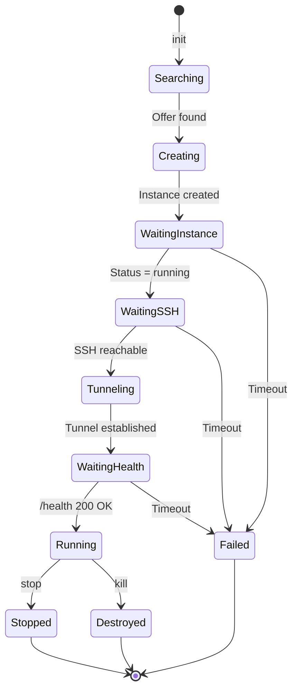
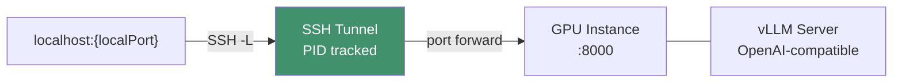

# Solution: Instance Deployment Logic

## Overview

`mycodeagent init <model>` deploys a vLLM-based model on a vast.ai GPU instance and exposes it as an OpenAI-compatible API on localhost. The entire startup is governed by a single `context.Context` with a per-model timeout (default 10 min, up to 15 min for multi-GPU models).

## Architecture Layers

Dependencies point inward: Infrastructure implements Domain interfaces. Domain has zero external imports.

## Deploy Flow

```mermaid
sequenceDiagram
    participant User
    participant CLI
    participant DeployService
    participant VastaiProvider
    participant SSHTunnelProvider
    participant VastAI as vast.ai API
    participant Remote as GPU Instance

    User->>CLI: mycodeagent init <model>
    CLI->>DeployService: Deploy(modelName)

    Note over DeployService: Create context with<br/>model.StartupTimeout

    DeployService->>DeployService: Resolve model profile
    DeployService->>VastaiProvider: SearchOffers(VRAM, numGPUs)
    VastaiProvider->>VastAI: GET /bundles (search)
    VastAI-->>VastaiProvider: Sorted offers
    VastaiProvider-->>DeployService: Cheapest offer

    DeployService->>DeployService: Build vLLM command
    DeployService->>VastaiProvider: CreateInstance(offerID, image, env, onstart)
    VastaiProvider->>VastAI: PUT /asks/{id}
    VastAI-->>VastaiProvider: instanceID
    VastaiProvider-->>DeployService: instanceID

    rect rgb(50, 50, 80)
        Note over DeployService,Remote: All waits share one context (timeout)
        DeployService->>VastaiProvider: WaitForInstance(ctx, instanceID)
        loop Poll every 10s until "running"
            VastaiProvider->>VastAI: GET /instances/{id}
            VastAI-->>VastaiProvider: status
        end
        VastaiProvider-->>DeployService: sshHost, sshPort, rate

        DeployService->>SSHTunnelProvider: WaitForSSH(ctx, host, port)
        loop Dial TCP every 5s
            SSHTunnelProvider->>Remote: TCP connect
        end
        SSHTunnelProvider-->>DeployService: SSH ready

        DeployService->>SSHTunnelProvider: FindFreePort(basePort)
        SSHTunnelProvider-->>DeployService: localPort

        DeployService->>SSHTunnelProvider: StartTunnel(localPort, host, port)
        SSHTunnelProvider-->>DeployService: tunnelPID

        DeployService->>SSHTunnelProvider: WaitForVLLMHealth(ctx, localPort)
        Note over SSHTunnelProvider: Runs in goroutine
        loop GET /health every 10s
            SSHTunnelProvider->>Remote: HTTP localhost:localPort/health
        end
        SSHTunnelProvider-->>DeployService: Healthy (or ctx timeout)
    end

    DeployService->>DeployService: Save instance to SQLite
    DeployService-->>CLI: Instance
    CLI-->>User: API available at localhost:{port}/v1
```

## Timeout Strategy

A single `context.WithTimeout` wraps the entire startup sequence. Each wait phase consumes from the same deadline -- if an earlier phase is slow, later phases have less time, and the whole flow fails cleanly on expiry.

### Per-Model Timeouts

| Model | Alias | GPUs | Timeout |
|---|---|---|---|
| `qwen3-5-35b-a3b-awq` | coder | 2x GPU (24 GB) | 20 min |
| `qwen3-vl-32b-instruct-awq` | coder_vl | 2x GPU | 15 min |
| `qwen25-32b-instruct-awq` | writer | 2x GPU | 15 min |
| `dolphin-glm-24b` | rude | 2x GPU | 15 min |
| `qwen25-coder-32b-gguf` | coder-2 | 1x GPU (24 GB) | 15 min |

Bigger models (multi-GPU, larger downloads) get longer timeouts. If `StartupTimeout` is unset, the default is **10 minutes**.

## Health Check Goroutine

The vLLM health check runs in a background goroutine to allow the context deadline to cancel it immediately:

Inside `WaitForVLLMHealth`, the goroutine polls `GET /health` every 10 seconds. Each iteration checks `ctx.Done()` via `select`, so cancellation is near-instant regardless of where the goroutine is in its polling cycle.

## Instance Lifecycle

## SSH Tunnel Detail

- Each `init` allocates a new local port (starting from `basePort`, scanning +100)
- Tunnel runs as a background `ssh -N -L` process; PID saved to SQLite
- `stop` sends SIGTERM to the tunnel PID, then stops the vast.ai instance
- `kill` destroys all instances and their tunnels
