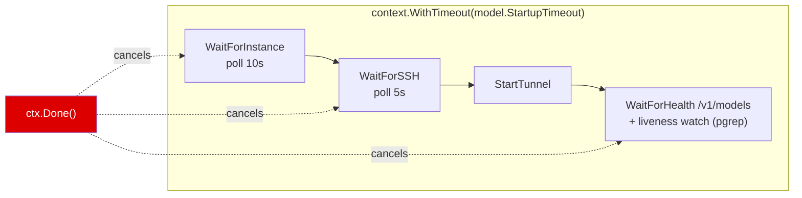
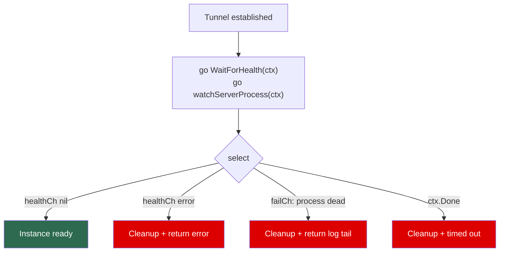
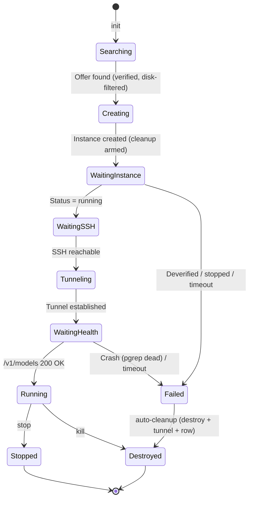
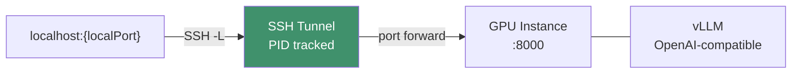

# Solution: Instance Deployment Logic

## Overview

`mycodeagent init <model>` deploys a model on a vast.ai GPU instance and exposes it as an OpenAI-compatible API on localhost. **vLLM is the only engine** (`vllm/vllm-openai`); every catalog model is a vLLM-servable quant (AWQ or FP8), never GGUF. The entire startup is governed by a single `context.Context` with a per-model timeout (default 10 min, up to 20 min for multi-GPU models).

**Instances are disposable (pay-as-you-go).** There are no persistent volumes — the model downloads to the ephemeral container disk on every `init` and is discarded when the instance is destroyed. A failed startup automatically tears the instance down so a broken `init` never leaves a paid GPU running. See [Disposable Instances & Storage](#disposable-instances--storage).

## Architecture Layers

The codebase follows a strict Clean Architecture layering enforced by code review and `grep` checks:

```
commands → application.App → domain/service → domain/repository
                                    ↓
                       infrastructure (adapters)
```

### The rules

1. **Commands** import only `internal/application` and `internal/domain/entity`. They never touch infrastructure (no `vastai.Client`, no `ssh.Adapter`, no `persistence.OpenDB`). Each command's `RunE` calls one or more methods on `*application.App` and formats the result.
2. **`application.App`** holds service references and orchestrates use cases. It never imports any package under `internal/infrastructure/`, never calls a repository directly, never constructs an infrastructure client. Persisting credentials goes through the `service.CredentialStore` domain interface, not `config.Save()`. Read access to credentials is via `app.VastaiAPIKey()` and `app.HFToken()` accessors.
3. **Domain services** (`internal/domain/service/`) own all business logic. They depend only on repository interfaces (`domain/repository`) and provider interfaces (`VastaiProvider`, `SSHTunnelProvider`, `EngineProvider`, `ServerProbe`, `CredentialStore`) — all defined in the `service` package itself. Services accept `context.Context` as the first argument on every public method.
4. **Domain repositories** are interface-only. The implementations live under `internal/infrastructure/persistence/`.
5. **Infrastructure** is the only layer allowed to import third-party clients (`vastai.Client`, sqlite drivers, etc.) and is responsible for translating between raw client types and domain DTOs (`service.RemoteInstance`, `entity.Instance`, etc.).

`go build ./...` plus three grep checks enforce the rules:

```bash
grep -r 'internal/infrastructure/' cmd/mycodeagent/commands/   # must be empty
grep -rn 'persistence\.\|sqlite\.'  internal/application/      # must be empty
grep -rn 'OpenDB\|NewSQLite\|NewStaticModelRepository' internal/application/   # must be empty
```

### Layer diagram


Solid arrows are concrete dependencies (struct fields). Dashed arrows are interface-implementation relationships — the `service` package only sees the interface; the `infrastructure` package provides the implementation, wired in `cmd/mycodeagent/main.go` (the composition root).

### Application orchestration

`application.App` is intentionally thin. Most methods are one-line delegations:

```go
func (app *App) Deploy(ctx context.Context, modelName string) (*entity.Instance, error) {
    return app.DeploySvc.Deploy(ctx, modelName)
}

func (app *App) SyncInstances(ctx context.Context) ([]*entity.Instance, error) {
    return app.InstanceSvc.Sync(ctx)
}
```

A few compose multiple service calls (`Stop` stops the vast.ai instance then kills the tunnel; `Login` verifies a key, optionally uploads an SSH key, then persists credentials). App **never** opens SQLite, **never** calls `repository.*` directly, and **never** constructs an infrastructure client.

### Domain services

| Service | Owns | Depends on |
|---|---|---|
| **`DeployService`** | The full `init` flow: search → create → wait → tunnel → save, with automatic teardown on failure. Also `Stop`, `Destroy`, `Restart`. | `InstanceRepository`, `BadHostRepository`, `ModelRepository`, `VastaiProvider`, `SSHTunnelProvider`, `EngineProvider`, basePort, hfToken |
| **`InstanceService`** | Read/write/orchestration over instances: CRUD, `Sync` (pull from vast.ai + reconcile), `EstablishTunnel`, `GetVastaiLogs`, `GetServedModelInfo`, `GetBudget`, credential operations. | `InstanceRepository`, `VastaiProvider`, `SSHTunnelProvider`, `ServerProbe`, `*ModelService`, basePort |
| **`ModelService`** | Static model catalog lookups: `List`, `FindByName`, `FindByAlias`. No `ctx` because the static repo has no I/O. | `ModelRepository` |
| **`BadHostService`** | Manage the `bad_hosts` blacklist (`List`, `Remove`, `Clear`). | `BadHostRepository` |

### Provider interfaces

All interfaces live in `internal/domain/service/` so the domain layer never imports infrastructure types:

| Interface | Purpose | Implementation |
|---|---|---|
| **`VastaiProvider`** | Vast.ai REST: search offers (with min host-disk filter), create/wait/destroy instances, instance read access (`GetInstance`, `ListRemoteInstances`, `GetInstanceLogs`), credential operations (`VerifyAPIKey`, `ListSSHKeys`, `CreateSSHKey`). Returns `service.RemoteInstance` DTOs, never raw `vastai.InstanceInfo`. | `vastai.Adapter` |
| **`SSHTunnelProvider`** | SSH operations: `StartTunnel`, `StopTunnel`, `WaitForSSH`, `FindFreePort`, `RunRemoteCommand`, `WaitForVLLMHealth`. | `ssh.Adapter` |
| **`EngineProvider`** | Engine-specific deploy details (Docker image, onstart script, restart commands). Single implementation. | `engine.VLLMEngine` |
| **`ServerProbe`** | Localhost `/v1/models` HTTP probe used to read served model id and `max_model_len`. Best-effort. | `serverprobe.Probe` |
| **`CredentialStore`** | Persists vast.ai key + HF token. Used only by `App.Login`. | `config.Store` |

### Engine Provider

`EngineProvider` abstracts vLLM-specific deployment details. There is one implementation, but the interface is kept so the domain depends on an abstraction rather than the concrete type. Signature (in `internal/domain/service/deploy_service.go`):

```go
type EngineProvider interface {
    DockerImage() string
    // numGPUs and contextLength come from the selected offer and the scaled
    // context computed by DeployService — they override anything in the model
    // definition so the search filter and the launched server stay in sync.
    BuildOnstart(model *entity.Model, numGPUs, contextLength int, hfToken string) string
    BuildRawCommand(model *entity.Model, numGPUs, contextLength int) string
    RestartCommands(model *entity.Model) (killCmd string, startCmd string)
}
```

| Engine | Docker Image | Model Format | Server Port |
|---|---|---|---|
| **VLLMEngine** | `vllm/vllm-openai:v0.19.0` | HuggingFace (AWQ / FP16 / FP8) | 8000 |

## Deploy Flow

```mermaid
sequenceDiagram
    participant User
    participant CLI
    participant DeployService
    participant VastaiProvider
    participant SSHTunnelProvider
    participant Remote as GPU Instance

    User->>CLI: mycodeagent init <model>
    CLI->>DeployService: Deploy(ctx, modelName)

    Note over DeployService: Wrap ctx with model.StartupTimeout

    DeployService->>DeployService: Resolve model; compute disk = Model.DiskGB
    DeployService->>VastaiProvider: SearchOffers(VRAM, numGPUs, disk+headroom)
    VastaiProvider-->>DeployService: Cheapest verified offer
    DeployService->>VastaiProvider: CreateInstance(offer, image, env, onstart, diskGB)
    VastaiProvider-->>DeployService: instanceID

    rect rgb(80, 40, 40)
        Note over DeployService: deferred cleanup armed —<br/>any failure below destroys the instance + tunnel
    end

    rect rgb(50, 50, 80)
        Note over DeployService,Remote: All waits share one context (timeout)
        DeployService->>VastaiProvider: WaitForInstance(ctx, instanceID)
        Note over VastaiProvider: poll until "running"; destroy on deverified
        VastaiProvider-->>DeployService: sshHost, sshPort, rate
        DeployService->>SSHTunnelProvider: WaitForSSH(ctx)
        DeployService->>SSHTunnelProvider: FindFreePort → StartTunnel
        SSHTunnelProvider-->>DeployService: tunnelPID

        par Health poll
            DeployService->>Remote: GET /v1/models every 10s
        and Liveness watch
            DeployService->>Remote: pgrep 'vllm serve' every 20s (after 90s grace)
        end
    end

    alt healthy
        DeployService->>DeployService: mark deployed=true (skip cleanup)
        DeployService-->>CLI: Instance (API at localhost:port/v1)
    else crash / timeout
        DeployService->>VastaiProvider: DestroyInstance + StopTunnel + delete row
        DeployService-->>CLI: error (no charges continue)
    end
```

## Timeout Strategy

A single `context.WithTimeout` wraps the entire startup sequence. Each wait phase consumes from the same deadline — if an earlier phase is slow, later phases have less time, and the whole flow fails cleanly on expiry.



### Per-Model Catalog & Timeouts

All models run on vLLM. Every `HFRepo` was verified to exist on HuggingFace and to be a vLLM-servable quant. `DiskGB` is the container disk requested (sized for the download + scratch); the offer search additionally requires the *host* to have `DiskGB + 25 GB` free.

| Model | Alias | Repo (quant) | GPUs | Disk | Context (base → max) | Timeout |
|---|---|---|---|---|---|---|
| `qwen3-8b-awq` | `coder-mini` | Qwen/Qwen3-8B-AWQ (AWQ) | 1× ≥16 GB | 30 GB | 131k → 131k | 10 min |
| `qwen3-30b-a3b-thinking-fp8` | `coder` | Qwen/Qwen3-30B-A3B-Thinking-2507-FP8 | 2× ≥24 GB | 60 GB | 131k → 262k | 20 min |
| `qwen3-coder-30b-a3b-fp8` | `coder-hq` | Qwen/Qwen3-Coder-30B-A3B-Instruct-FP8 | 2× ≥24 GB | 60 GB | 131k → 262k | 20 min |
| `qwen25-32b-instruct-awq` | `writer` | Qwen/Qwen2.5-32B-Instruct-AWQ | 2× ≥24 GB | 45 GB | 32k → 131k | 15 min |
| `dolphin-29-llama3-8b-awq` | `rude` | solidrust/dolphin-2.9-llama3-8b-AWQ | 1× ≥16 GB | 30 GB | 8k → 8k | 10 min |
| `qwen3-30b-a3b-abliterated-fp8` | `rude-pro` | hotpizzatactics/Qwen3-30B-A3B-abliterated-FP8-dynamic | 2× ≥24 GB | 60 GB | 32k → 32k | 20 min |

If `StartupTimeout` is unset, the default is **10 minutes**. `scaledContextLength` grows `ContextLength` toward `MaxContextLength` when the rented offer has more per-GPU VRAM than the catalog baseline.

**FP8 on Ampere:** the FP8 checkpoints run on RTX 3090 (Ampere, compute 8.6) via vLLM's `fp8-marlin` W8A16 path; native FP8 compute needs Ada/Hopper (RTX 4090 / L40 / H100), where they're faster. Both satisfy the `compute_cap >= 8.0` search filter.

## Disposable Instances & Storage

The tool is built for a **pay-as-you-go personal LLM environment**: rent a GPU only while coding, destroy it when done, pay only for GPU-hours.

vast.ai bills two storages, *both* charged even when the GPU is idle (storage default ~$0.15/GB/month): the container disk (while the instance exists, including when `stop`ped) and **volumes** (24/7 for as long as the volume exists, pinned to one physical machine). Persistent volumes were therefore removed:

- The deploy always picks the globally cheapest offer, which lands on a different machine almost every time — so a machine-pinned volume was almost always a cache *miss* yet kept billing, and orphaned volumes accumulated.
- Re-downloading from HuggingFace on each cold start (6 GB AWQ ≈ a minute, 30 GB FP8 ≈ a few minutes; egress is free) is cheaper and simpler than maintaining a volume.

Consequences in the design:
- `CreateInstance` requests a per-model `disk` (`Model.DiskGB`); `SearchOffers` filters hosts on `DiskGB + 25 GB` free so the model download + the ~15 GB image + scratch always fit. There is no fixed 40 GB cap.
- `stop` keeps the instance (still bills container-disk storage); `kill` destroys it (no further charges). For pay-as-you-go, prefer `kill` when done.

## Failure Handling & Cleanup

A failed `init` must never leave a paid GPU running. After `CreateInstance` succeeds, `Deploy` arms a deferred cleanup that — unless the deploy reaches `deployed = true` — destroys the vast.ai instance, kills the SSH tunnel, and deletes the local DB row. This covers every failure path: `WaitForInstance`, `WaitForSSH`, tunnel start, health timeout, and server crash.

**Liveness watcher (fail fast).** The health check only polls `GET /v1/models`, which can't tell "still downloading" from "crashed". Alongside it, `watchServerProcess` SSHes every 20 s (after a 90 s grace) and runs `pgrep -f 'vllm serve'`. Two consecutive "dead" reads abort the deploy with the tail of `/tmp/vllm.log`, instead of waiting out the full 10–20 min timeout. The two-read requirement avoids false positives during a brief re-exec.

**Host blacklisting is host-side only.** `markHostBad` records a machine in `bad_hosts` (auto-skipped on future searches) **only** when the instance never reached running or SSH never came up. A model-side failure (server crash, health timeout) does *not* blame the host — otherwise a misconfigured model would slowly blacklist every good machine until "no offers found".

## Health Check

The health check polls `GET /v1/models` (OpenAI-compatible) in a background goroutine and races against the liveness watcher and `ctx.Done()`:



## Instance Lifecycle



## SSH Tunnel Detail



- Each `init` allocates a new local port (starting from `basePort`, scanning +100).
- Tunnel runs as a background `ssh -N -L` process; PID saved to SQLite.
- `stop` SIGTERMs the tunnel PID, then stops the vast.ai instance; `kill` destroys the instance + tunnel.
- `restart` regenerates the onstart script on the instance and restarts the server.

## vLLM Parameters Reference

The `VLLMEngine` builds the `vllm serve` command in `internal/infrastructure/engine/vllm.go`. Two flags are always emitted by the engine and cannot be set in the catalog (they'd be stripped by `stripFlagPair`):

- `--tensor-parallel-size <NumGPUs>` — from the actual rented offer's GPU count, not `model.NumGPUs` (which is only the search-filter minimum).
- `--max-model-len <ContextLength>` — from `scaledContextLength()`, which grows `model.ContextLength` toward `model.MaxContextLength` with per-GPU VRAM headroom.

Everything else comes from `model.VLLMArgs` in `internal/infrastructure/persistence/model_repo_static.go`.

### Currently used in the catalog

| Flag | Purpose | Notes |
|---|---|---|
| `--quantization <method>` | Force a specific quant kernel. | **Usually omit.** For AWQ on Ampere+ vLLM auto-promotes to `awq_marlin` (1.5–2× faster); forcing plain `awq` blocks that. FP8 checkpoints declare their format in `config.json` — don't set `--quantization fp8`. |
| `--dtype <type>` | Compute dtype. | Pin `half` on dense AWQ models because some Ampere kernels need fp16, not bf16. Don't set for FP8/MoE. |
| `--gpu-memory-utilization <0..1>` | Fraction of VRAM vLLM may use. Default `0.9`. | Lower (`0.85`) on OOM during CUDA-graph capture; raise (`0.95`) on dedicated boxes where KV is the bottleneck. |
| `--kv-cache-dtype fp8` | Store KV in fp8. | Halves KV memory — roughly doubles max context. Used on the 8B (to fit 131k on 16 GB) and the FP8 MoE coders. |
| `--max-num-seqs <N>` | Cap concurrent sequences. | Lower (`8`) when KV memory is the bottleneck (frees blocks for longer sequences). |
| `--rope-scaling '<json>'` | YaRN/linear context extension at load. | Single-quoted JSON so bash doesn't brace-expand it. Used on Qwen3-8B and Qwen2.5-32B to extend past native 32k. |
| `--enable-prefix-caching` | Reuse KV across shared prefixes. | Free latency win for agent loops (system prompt + tool schema never change). |
| `--enable-auto-tool-choice` + `--tool-call-parser <name>` | Emit OpenAI `tool_calls`. | Required for tool-calling clients. Catalog uses `qwen3_xml` (Qwen3 family) and `hermes` (Qwen2.5). Wrong parser → tool calls leak as plain text. |
| `--reasoning-parser <name>` | Split `<think>…</think>` into `reasoning_content`. | `qwen3` for the thinking models. Without it the client sees raw `<think>` tokens. |
| `--enable-expert-parallel` | Shard MoE experts across TP ranks. | **Required** for the 30B-A3B FP8 MoE models to fit on 2×24 GB (experts sharded, not replicated). |
| `--trust-remote-code` | Allow custom modeling code from the repo. | Needed for Qwen MoE / custom configs; harmless on standard models. |

### Likely-needed for tuning (not currently set)

| Flag | When to reach for it |
|---|---|
| `--max-num-batched-tokens <N>` | Throughput on bigger boxes (up) vs single-user latency (down). |
| `--block-size <N>` | Only when profiling shows KV fragmentation. |
| `--enforce-eager` | Skip CUDA-graph capture (~30–60 s faster startup, ~10–20 % slower runtime) when iterating on a deploy. |
| `--served-model-name <alias>` | Override the id reported by `/v1/models` so opencode keys can be short. |
| `--cpu-offload-gb <GB>` | Last-resort weight offload to CPU RAM (big throughput hit). |
| `--limit-mm-per-prompt '{"image":N}'` | Cap vision input cost per request (VL models). |

> **Removed in vLLM v1 (v0.19.0):** `--swap-space` errors with "unrecognized arguments". The v1 replacements are `--kv-cache-memory-bytes` and `--cpu-offload-gb`.

### Always set by the engine (do not put in catalog)

| Flag | Source |
|---|---|
| `--host 0.0.0.0` | hardcoded in `vllm.go` |
| `--port 8000` | hardcoded; the SSH tunnel maps `localPort → 8000` |
| `--tensor-parallel-size <N>` | from `offer.NumGPUs` (actual rented count) |
| `--max-model-len <N>` | from `scaledContextLength(model, offer.GPUMemory)` |

### General tuning order when something is wrong

1. **OOM during weight load** → bump `NumGPUs` in the catalog (more shards).
2. **OOM during CUDA-graph capture** → drop `--gpu-memory-utilization` 0.95 → 0.90 → 0.85.
3. **OOM "KV cache too small"** → add/keep `--kv-cache-dtype fp8` → drop `--max-num-seqs` to 8 → drop `ContextLength`.
4. **Slow first token** → confirm `--enable-prefix-caching`; check `/tmp/vllm.log` for `awq_marlin` (not plain `awq`).
5. **Tool calls leak as plain text** → wrong `--tool-call-parser` for the model family.
6. **`<think>…</think>` in chat** → missing `--reasoning-parser`.
7. **Startup "hangs" at "Capturing CUDA graphs"** → not hung, takes 30–90 s; add `--enforce-eager` to skip while iterating.

### Reference

- Full vLLM CLI: `vllm serve --help`, or https://docs.vllm.ai/en/latest/cli/serve
- Quantization auto-detect: `vllm/model_executor/layers/quantization/awq_marlin.py`
- Registered parsers (v0.19.0): `vllm/tool_parsers/__init__.py`, `vllm/reasoning/__init__.py`
