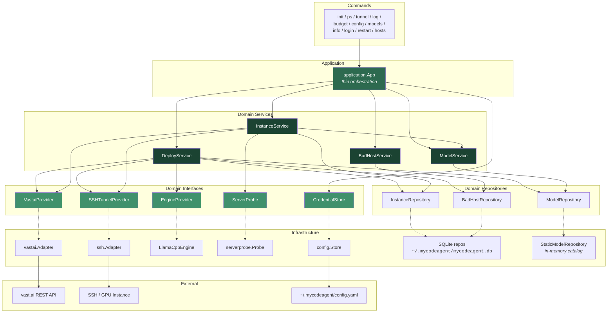
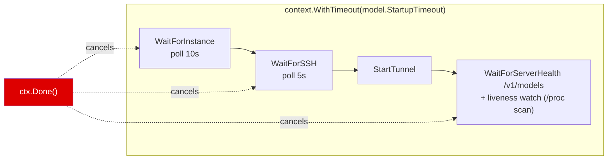
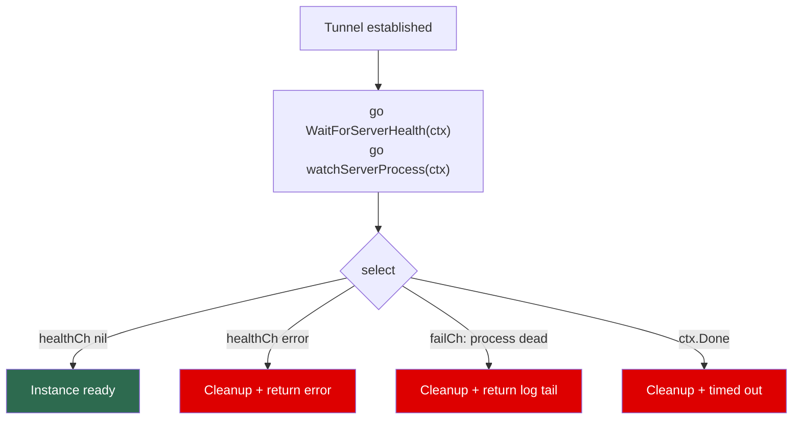
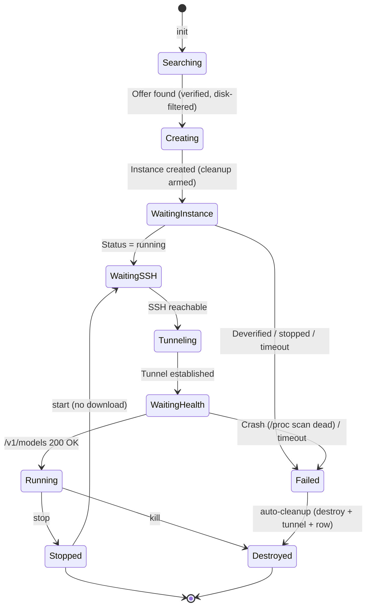

# Solution: Instance Deployment Logic

## Overview

`mycodeagent init <model>` deploys a model on a vast.ai GPU instance and exposes it as an OpenAI-compatible API on localhost. **llama.cpp is the only engine** (`ghcr.io/ggml-org/llama.cpp:server-cuda-*`); every catalog model is a GGUF quant fetched by `llama-server -hf <repo>:<quant>`. The entire startup is governed by a single `context.Context` with a per-model timeout (default 20 min; 16–30 min in the current catalog).

**Why llama.cpp and not vLLM.** This is a single-user, pay-as-you-go environment with no concurrent load, and vLLM's advantages — continuous batching, PagedAttention scheduling — only pay off at concurrency ≫ 1. What it charges for instead is exactly what costs money here: a ~15 GB image pull on every disposable `init`, a minute or two of `torch.compile` + CUDA-graph capture, and FP8 weights too large for one card. Swapping to 4-bit GGUF put every catalog model back on a **single** GPU (see the table below), which roughly halves the hourly rate and widens the pool of usable offers. The tradeoffs accepted in exchange are documented under [Engine tradeoffs](#engine-tradeoffs).

**Instances are disposable (pay-as-you-go).** There are no persistent volumes — the model downloads to the ephemeral container disk on every `init` and is discarded when the instance is destroyed. A failed startup automatically tears the instance down so a broken `init` never leaves a paid GPU running. See [Disposable Instances & Storage](#disposable-instances--storage).

## Architecture Layers

The codebase follows a strict Clean Architecture layering enforced by code review and `grep` checks:

```
commands → application.App → domain/service → domain/repository
                                    ↓
                       infrastructure (adapters)
```

### The rules

1. **Commands** import only `internal/application` and `internal/domain/entity`. They never touch infrastructure (no `vastai.Client`, no `ssh.Adapter`, no `persistence.OpenDB`). Each command's `RunE` calls one or more methods on `*application.App` and formats the result.
2. **`application.App`** holds service references and orchestrates use cases. It never imports any package under `internal/infrastructure/`, never calls a repository directly, never constructs an infrastructure client. Persisting credentials goes through the `service.CredentialStore` domain interface, not `config.Save()`. Read access to credentials is via `app.VastaiAPIKey()` and `app.HFToken()` accessors.
3. **Domain services** (`internal/domain/service/`) own all business logic. They depend only on repository interfaces (`domain/repository`) and provider interfaces (`VastaiProvider`, `SSHTunnelProvider`, `EngineProvider`, `ServerProbe`, `CredentialStore`) — all defined in the `service` package itself. Services accept `context.Context` as the first argument on every public method.
4. **Domain repositories** are interface-only. The implementations live under `internal/infrastructure/persistence/`.
5. **Infrastructure** is the only layer allowed to import third-party clients (`vastai.Client`, sqlite drivers, etc.) and is responsible for translating between raw client types and domain DTOs (`service.RemoteInstance`, `entity.Instance`, etc.).

`go build ./...` plus three grep checks enforce the rules:

```bash
grep -r 'internal/infrastructure/' cmd/mycodeagent/commands/   # must be empty
grep -rn 'persistence\.\|sqlite\.'  internal/application/      # must be empty
grep -rn 'OpenDB\|NewSQLite\|NewStaticModelRepository' internal/application/   # must be empty
```

### Layer diagram



Solid arrows are concrete dependencies (struct fields). Dashed arrows are interface-implementation relationships — the `service` package only sees the interface; the `infrastructure` package provides the implementation, wired in `cmd/mycodeagent/main.go` (the composition root).

### Application orchestration

`application.App` is intentionally thin. Most methods are one-line delegations:

```go
func (app *App) Deploy(ctx context.Context, modelName string) (*entity.Instance, error) {
    return app.DeploySvc.Deploy(ctx, modelName)
}

func (app *App) SyncInstances(ctx context.Context) ([]*entity.Instance, error) {
    return app.InstanceSvc.Sync(ctx)
}
```

A few compose multiple service calls (`Stop` stops the vast.ai instance then kills the tunnel; `Login` verifies a key, optionally uploads an SSH key, then persists credentials). App **never** opens SQLite, **never** calls `repository.*` directly, and **never** constructs an infrastructure client.

### Domain services

| Service | Owns | Depends on |
|---|---|---|
| **`DeployService`** | The full `init` flow: search → create → wait → tunnel → save, with automatic teardown on failure. Also `Stop`, `Destroy`, `Restart`. | `InstanceRepository`, `BadHostRepository`, `ModelRepository`, `VastaiProvider`, `SSHTunnelProvider`, `EngineProvider`, basePort, hfToken |
| **`InstanceService`** | Read/write/orchestration over instances: CRUD, `Sync` (pull from vast.ai + reconcile), `EstablishTunnel`, `GetVastaiLogs`, `GetServedModelInfo`, `GetBudget`, credential operations. | `InstanceRepository`, `VastaiProvider`, `SSHTunnelProvider`, `ServerProbe`, `*ModelService`, basePort |
| **`ModelService`** | Static model catalog lookups: `List`, `FindByName`, `FindByAlias`. No `ctx` because the static repo has no I/O. | `ModelRepository` |
| **`BadHostService`** | Manage the `bad_hosts` blacklist (`List`, `Remove`, `Clear`). | `BadHostRepository` |

### Provider interfaces

All interfaces live in `internal/domain/service/` so the domain layer never imports infrastructure types:

| Interface | Purpose | Implementation |
|---|---|---|
| **`VastaiProvider`** | Vast.ai REST: search offers (with min host-disk filter), create/wait/destroy instances, instance read access (`GetInstance`, `ListRemoteInstances`, `GetInstanceLogs`), credential operations (`VerifyAPIKey`, `ListSSHKeys`, `CreateSSHKey`). Returns `service.RemoteInstance` DTOs, never raw `vastai.InstanceInfo`. | `vastai.Adapter` |
| **`SSHTunnelProvider`** | SSH operations: `StartTunnel`, `StopTunnel`, `WaitForSSH`, `FindFreePort`, `RunRemoteCommand`, `WaitForServerHealth`. | `ssh.Adapter` |
| **`EngineProvider`** | Engine-specific deploy details (Docker image, onstart script, restart commands, liveness probe, log path). Single implementation. | `engine.LlamaCppEngine` |
| **`ServerProbe`** | Localhost HTTP probe: `/v1/models` for the served model id, then `/props` for the real `n_ctx`. Best-effort. | `serverprobe.Probe` |
| **`CredentialStore`** | Persists vast.ai key + HF token. Used only by `App.Login`. | `config.Store` |

### Engine Provider

`EngineProvider` abstracts llama.cpp-specific deployment details. There is one implementation, but the interface is kept so the domain depends on an abstraction rather than the concrete type. Signature (in `internal/domain/service/deploy_service.go`):

```go
type EngineProvider interface {
    DockerImage() string
    // numGPUs and contextLength come from the selected offer and the scaled
    // context computed by DeployService — they override anything in the model
    // definition so the search filter and the launched server stay in sync.
    BuildOnstart(model *entity.Model, numGPUs, contextLength int, hfToken string) string
    BuildRawCommand(model *entity.Model, numGPUs, contextLength int) string
    RestartCommands(model *entity.Model) (killCmd string, startCmd string)
    // LivenessCommand prints ALIVE or DEAD; LogPath is where the server log is
    // teed. Both live here so DeployService never hardcodes a process name,
    // a probing tool or a path.
    LivenessCommand() string
    LogPath() string
}
```

| Engine | Docker Image | Model Format | Server Port |
|---|---|---|---|
| **LlamaCppEngine** | `ghcr.io/ggml-org/llama.cpp:server-cuda-b10156` | GGUF (`-hf <repo>:<quant>`) | 8000 |

#### Image constraints worth knowing

The image is deliberately minimal — `nvidia/cuda:12.8.1-runtime-ubuntu24.04` plus `libgomp1 curl ffmpeg` — and three properties of it leak into the design:

1. **No procps.** `pgrep`/`pkill`/`ps` are not installed. The liveness probe and the restart kill sweep therefore scan `/proc/*/cmdline` with `grep`. The match pattern is written `llama-serve[r]`, because the command text itself lands in the argv of the shell that runs it: an unbracketed pattern would make the probe always report ALIVE and make the kill sweep shoot its own SSH session. `engine.TestProcessCommandsAvoidProcpsAndSelfMatch` locks both properties in.
2. **`/app` is not on `PATH`.** Only the image `ENTRYPOINT` relies on `WORKDIR=/app`, and vast.ai replaces the entrypoint for `runtype: "ssh"`. The onstart script resolves the binary itself, preferring a `PATH` hit and falling back to `/app/llama-server`, then `cd`s beside it — the CUDA build uses `GGML_BACKEND_DL`, so the ggml backend `.so` files sit next to the binary.
3. **CUDA 12.8.1.** That is exactly the `cuda_max_good >= 12.8` floor the offer search filters on. Bumping the image to a newer CUDA base requires bumping that filter in `vastai/client.go`, or deploys land on hosts whose driver cannot run the runtime (consumer GPUs have no CUDA forward compat).

Upgrading the engine is a one-line change to `DockerImage()`; tags are listed at `ghcr.io/ggml-org/llama.cpp` as `server-cuda-b<build>`.

## Deploy Flow

```mermaid
sequenceDiagram
    participant User
    participant CLI
    participant DeployService
    participant VastaiProvider
    participant SSHTunnelProvider
    participant Remote as GPU Instance

    User->>CLI: mycodeagent init <model>
    CLI->>DeployService: Deploy(ctx, modelName)

    Note over DeployService: Wrap ctx with model.StartupTimeout

    DeployService->>DeployService: Resolve model; compute disk = Model.DiskGB
    DeployService->>VastaiProvider: SearchOffers(VRAM, numGPUs, disk+headroom)
    VastaiProvider-->>DeployService: Cheapest verified offer
    DeployService->>VastaiProvider: CreateInstance(offer, image, env, onstart, diskGB)
    VastaiProvider-->>DeployService: instanceID

    rect rgb(80, 40, 40)
        Note over DeployService: deferred cleanup armed —<br/>any failure below destroys the instance + tunnel
    end

    rect rgb(50, 50, 80)
        Note over DeployService,Remote: All waits share one context (timeout)
        DeployService->>VastaiProvider: WaitForInstance(ctx, instanceID)
        Note over VastaiProvider: poll until "running"; destroy on deverified
        VastaiProvider-->>DeployService: sshHost, sshPort, rate
        DeployService->>SSHTunnelProvider: WaitForSSH(ctx)
        DeployService->>SSHTunnelProvider: FindFreePort → StartTunnel
        SSHTunnelProvider-->>DeployService: tunnelPID

        par Health poll
            DeployService->>Remote: GET /v1/models every 10s
        and Liveness watch
            DeployService->>Remote: engine.LivenessCommand() every 20s (after 90s grace)
        end
    end

    alt healthy
        DeployService->>DeployService: mark deployed=true (skip cleanup)
        DeployService-->>CLI: Instance (API at localhost:port/v1)
    else crash / timeout
        DeployService->>VastaiProvider: DestroyInstance + StopTunnel + delete row
        DeployService-->>CLI: error (no charges continue)
    end
```

## Timeout Strategy

A single `context.WithTimeout` wraps the entire startup sequence. Each wait phase consumes from the same deadline — if an earlier phase is slow, later phases have less time, and the whole flow fails cleanly on expiry.



### Per-Model Catalog & Timeouts

The catalog spans four VRAM tiers — **16 / 24 / 32 / 48 GB** — plus a speed-first alternative at 24 GB and one uncensored model at 32 GB. Everything is single-GPU. Every `HFRepo` + `Quant` pair was verified against the HuggingFace API (the repo exists, the quant tag matches exactly one file, and the chat template really declares thinking + tool support). `DiskGB` is the container disk requested (image + download + scratch); the offer search additionally requires the *host* to have `DiskGB + 12 GB` free.

| Tier | Model | Alias | Repo | Quant | Weights | Active | Disk | Context | Timeout |
|---|---|---|---|---|---|---|---|---|---|
| 16 GB | `qwen35-9b` | `coder-mini` | unsloth/Qwen3.5-9B-GGUF | UD-Q5_K_XL | 6.7 GB | 9B | 20 GB | 64k | 16 min |
| 24 GB | `qwen36-27b-24g` | `coder` | unsloth/Qwen3.6-27B-GGUF | IQ4_XS | 15.4 GB | 27B | 28 GB | 32k | 22 min |
| 24 GB | `qwen36-35b-a3b` | `coder-fast` | unsloth/Qwen3.6-35B-A3B-GGUF | UD-IQ4_XS | 17.7 GB | **3B** | 32 GB | 64k | 24 min |
| 32 GB | `qwen36-27b-32g` | `coder-hq` | unsloth/Qwen3.6-27B-GGUF | Q5_K_M | 19.5 GB | 27B | 32 GB | 64k | 26 min |
| 48 GB | `qwen36-27b-48g` | `coder-max` | unsloth/Qwen3.6-27B-GGUF | UD-Q6_K_XL | 25.6 GB | 27B | 38 GB | **128k** | 30 min |
| 32 GB | `qwen36-35b-a3b-abliterated` | `rude` | mradermacher/Huihui-Qwen3.6-35B-A3B-abliterated-i1-GGUF | Q4_K_M | 21.2 GB | **3B** | 34 GB | **128k** | 26 min |

`MaxContextLength` is 262144 (native) on every entry, so `scaledContextLength` grows the window whenever the rented offer has more per-GPU VRAM than the tier baseline. If `StartupTimeout` is unset the default is **20 minutes**.

#### Where the timeout numbers come from

One context covers the whole deploy — provisioning, SSH, download and weight load all draw on the same deadline — so the budget has to survive the worst case of each phase, not the typical one:

```
timeout = 10 min provisioning + (size / 25 MB/s) + 1 min VRAM load
```

Both constants are measured. **Provisioning** (offer accepted → `actual_status: running`) is the host pulling and unpacking the image; it took **9.3 minutes** on a slow host and seconds on a good one, and nothing in this tool can influence it. **25 MB/s** is a deliberately pessimistic download rate: 43 MB/s was observed on a healthy host, and halving it leaves room for a bad one.

Erring generous is close to free. A doomed deploy burns pennies of GPU time before the timeout fires, a genuinely *dead* server is caught within seconds by the liveness watcher regardless of the deadline, and the instance self-destroys either way. Erring stingy costs the entire deploy. The original 8–15 minute values could not even cover the provisioning phase alone on a slow host — a `rude` deploy died with ~11.5 of its 14 minutes spent before `llama-server` had read a single byte of the GGUF.

**Slow hosts are now caught.** Such a failure surfaces as a health-check timeout, which the original rule classified as model-side — so the machine stayed in the offer pool and the next `init` could pick it straight back up. `Deploy` therefore times the provisioning phase and keeps the number: if a deploy later dies on the deadline **and** provisioning alone exceeded `slowProvisionThreshold` (5 min, half the budgeted allowance), the host is blacklisted.

Provisioning duration is the right evidence because it is the one phase no model, quant or flag can influence — it is purely the host pulling and unpacking the image. That makes it admissible even though the failure surfaced later, in a phase where the model *could* be at fault.

The crash path is deliberately excluded. A dead `llama-server` means a bad quant, a flag the build rejects, or not enough VRAM; blaming the host for that is exactly how a single misconfigured catalog entry would blacklist every good machine one deploy at a time until the search returns "no offers found". `TestDeployNeverBlamesHostForACrash` locks that in, and `TestDeployDoesNotBlameAPromptHostForATimeout` guards the other direction — a host that provisioned promptly is never blamed for a model that simply needed longer.

### The selection criterion: capability first

The working tiers are **dense** models, chosen deliberately. A dense 27B uses all 27B parameters on every token; a 35B-A3B MoE activates only 3B and behaves closer to a ~10B model. The MoE is roughly 3× faster (≈60–100 vs ≈20–30 tok/s) and holds far more context — but at ~20–30 tok/s the dense model is still comfortable for interactive coding, so the extra speed buys nothing that capability wouldn't buy better.

The MoE is kept as one explicit `coder-fast` entry on the same 24 GB card, so the trade is a choice rather than a default:

| At 24 GB | `coder` (dense 27B) | `coder-fast` (MoE 35B-A3B) |
|---|---|---|
| Active params | 27B | 3B |
| Effective capability | ~27B | ~10B |
| Throughput | ~20–30 tok/s | ~60–100 tok/s |
| Context | 32k | 64k |

The upper tiers are the **same** 27B with progressively better quant and more window: `IQ4_XS` → `Q5_K_M` → `UD-Q6_K_XL`. At ~6.5 bpw the 48 GB entry is effectively lossless, so `coder-max` is the 27B at full strength with a 128k window.

### Sizing

Every entry satisfies, per GPU:

```
weights + KV(ctx) + ~1.5 GB compute buffers  <  usable VRAM
```

Usable VRAM sits below nameplate — a "24 GB" 3090 reports ~23.4 — and KV per token at `q8_0` is `2 × n_layers × n_kv_heads × head_dim × ~1.06` bytes. That number, not the weights, decides the context:

| Model | Shape | L | KV heads | head_dim | KV/token |
|---|---|---|---|---|---|
| Qwen3.5-9B | dense | 32 | 4 | 256 | 68 KB |
| Qwen3.6-27B | dense | 64 | 4 | 256 | **136 KB** |
| Qwen3.6-35B-A3B | MoE | 40 | **2** | 256 | **42 KB** |
| Qwen3.5-122B-A10B (not used) | MoE | 48 | 2 | 256 | 51 KB |
| GLM-4.7-Flash (not used) | MoE-Lite | 47 | **20** | 102 | 199 KB |

The dense 27B's 136 KB/token is 3.2× the MoE's, which is the whole reason `coder` gets 32k where `coder-fast` gets 64k on the same card. GLM-4.7-Flash was passed over for the opposite extreme: 199 KB/token eats 13 GB at 64k.

**Quant tags must be unique substrings** of a filename in the repo. `Q6_K` is **not** — it also matches `UD-Q6_K_XL`, and llama.cpp would silently resolve to whichever it finds first. That is why the 32 GB tier uses `Q5_K_M` and the 48 GB tier names `UD-Q6_K_XL` explicitly. Verify any new tag against the repo's file list before adding it.

**Also considered for 48 GB:** `Qwen3.5-122B-A10B` at `UD-IQ2_M` (39.1 GB, ~35B-equivalent, 10B active). Bigger on paper and would fit at 126k, but 2-bit degradation is real and it is a generation behind Qwen3.6 — the near-lossless 27B was the safer capability bet.

**No YaRN anywhere.** Qwen3.5 and Qwen3.6 are natively 262144 context, so the `--rope-scaling` / `--rope-scale` / `--yarn-orig-ctx` triple the old Qwen3 / Qwen2.5 catalog needed is gone — along with the short-context quality it cost.

**Vision is off.** Several of these repos ship a ~0.9 GB `mmproj` vision projector that `-hf` auto-downloads and offloads to VRAM. Everything is served text-only via `--no-mmproj`. To enable vision, drop the flag and set `Vision: true`.

**Tightest entry.** `coder-fast` at 17.7 + 2.8 + 1.5 = 22.0 GB of ~23.4 has the least margin. llama.cpp auto-fits the context down rather than OOMing, and `GET /props` reports what was actually loaded — see the tuning ladder below if it lands short.

**Single GPU everywhere.** That is the right shape for llama.cpp: its multi-GPU default is a *layer* (pipeline) split, where only one card computes at a time, so a second GPU buys VRAM but almost no batch-1 speed. If a future model does need two, the engine emits `--split-mode layer` explicitly unless the catalog picked a mode itself.

Note that `SearchOffers` filters `num_gpus` with **`eq`**, not `gte` — the rented offer always has exactly `model.NumGPUs` cards. So `offer.NumGPUs` can never exceed the catalog value, the `--split-mode` branch is currently unreachable (every entry is `NumGPUs: 1`), and only *VRAM per GPU* varies between the search filter and the rental. That is why `scaledContextLength` scales on `offer.GPUMemory` alone.

### vast.ai price ladder (measured, single GPU, same filters `init` uses)

| Tier | Cheapest | Typical cards | vs 32 GB |
|---|---|---|---|
| 16 GB | $0.069/hr | wide choice | 0.34× |
| 24 GB | $0.116/hr | RTX 3090 | 0.57× |
| 32 GB | $0.202/hr | RTX 4080S, 5090, PRO 4500 | 1× |
| 48 GB | $0.376/hr | RTX 4090-48G, 5880Ada, L40, 6000Ada | 1.9× |
| 64 GB | $0.876/hr | — nothing sits here — | 4.3× |
| 80–96 GB | $0.876/hr | RTX PRO 6000 WS (96 GB), A100 | 4.3× |

**There is no 64 GB tier**: the cheapest "≥64 GB" offer is a 96 GB RTX PRO 6000 WS at the same price as the 80 GB tier. The real ladder is 16 → 24 → 32 → 48 → 96. 48 GB is the only sensible next step (+90%) — that is exactly what `coder-max` rents, and it is the last step before the price jumps 4.3×.

### Why the frontier MoE models (GLM-5.2, Kimi-K3) are out of scope

Worth writing down, because the obvious objection — "they can't fit" — is not actually the reason, and the real reason is specific to this tool's design.

Both use **MLA** (multi-head latent attention, `kv_lora_rank: 512`), so their KV cache is *compressed into a latent vector* and the usual `2 × L × kv_heads × head_dim` formula does not apply. Their caches are tiny — comparable to our small MoE models:

| Model | KV/token @q8 | 32k | 128k |
|---|---|---|---|
| GLM-5.2 | 46.6 KB | 1.6 GB | 6.3 GB |
| Kimi-K3 | 55.6 KB | 1.9 GB | 7.5 GB |

The constraint is the **weights**, and because they are MoE, those don't have to live in VRAM: `--n-cpu-moe` keeps expert layers in system RAM while attention and the KV cache stay on the GPU. High-RAM hosts are cheap on vast.ai because nothing else bids for RAM, so the price is not prohibitive either (measured, verified hosts, on-demand):

| Target | Weights | Needs | Cheapest offer |
|---|---|---|---|
| GLM-5.2 `UD-IQ2_XXS` | 238 GB | RAM ≥ 320 GB, disk ≥ 340 GB | **$0.456/hr** (2× 3090, 504 GB RAM, 3.2 TB disk) |
| GLM-5.2 `UD-IQ4_XS` | 365 GB | RAM ≥ 448 GB, disk ≥ 480 GB | **$0.456/hr** (same box) |
| Kimi-K3 `UD-IQ1_S` | 594 GB | RAM ≥ 640 GB, disk ≥ 700 GB | **$1.138/hr** (1× 4090, 882 GB RAM, 6.5 TB disk) |

So roughly 2–6× the 32 GB tier. What actually rules them out is the **disposable-instance model**:

1. **Download time per `init`.** There are no persistent volumes by design, so 238–594 GB is re-downloaded from HuggingFace on *every* deploy — 20 minutes at 300 MB/s, over an hour at 100 MB/s. The GPU bills the whole time. This is the fundamental conflict: the pay-as-you-go design that makes a 17 GB model cheap makes a 365 GB model absurd.
2. **Throughput.** With experts in system RAM, generation is bound by RAM bandwidth and CPU FFN compute — order **2–8 tok/s**. Tolerable for chat, unusable for an agent loop that emits thousands of tokens per turn.

Supporting one would also need real code, not a catalog row: a `cpu_ram` filter in `SearchOffers` (there is none today — vast.ai would happily land us on a 47 GB RAM host), a `CPURAMGB` field on `entity.Model`, `--n-cpu-moe` in the args, and startup timeouts in the hour range. If it is ever wanted, the honest shape is a *persistent* instance you start and keep — the opposite of what this tool does.

Cheaper middle ground if the appetite is for something bigger than 35B: the REAP-pruned variants (`unsloth/GLM-4.7-Flash-REAP-23B-A3B-GGUF`, `0xSero/GLM-5.2-REAP-504B-GGUF`) drop a large fraction of experts and land far closer to a single-GPU budget.

### Engine tradeoffs

What the migration gave up, so nobody rediscovers it as a bug:

| Area | vLLM | llama.cpp today |
|---|---|---|
| Weight precision | AWQ / FP8 | 4-bit GGUF — a real if small quality loss |
| Concurrency | continuous batching, strong at N ≫ 1 | `-np 1`: one slot owns the whole context; parallel sub-agent requests queue instead of interleaving |
| Tool calls | `--tool-call-parser qwen3_xml` / `hermes` | `--jinja`, parsed by the chat template baked into the GGUF — correctness depends on the quant publisher's template |
| Reasoning split | `--reasoning-parser qwen3` | `--reasoning-format deepseek` → `message.reasoning_content` |
| Dense multi-GPU | tensor parallel — real speedup | layer split — VRAM only, no speedup |

The one scenario that argues for going back is sustained concurrency: several opencode sessions, or an agent that fans out sub-agents in parallel. At batch ≥ 4 vLLM pulls ahead of a single-slot `llama-server`.

## Disposable Instances & Storage

The tool is built for a **pay-as-you-go personal LLM environment**: rent a GPU only while coding, destroy it when done, pay only for GPU-hours.

vast.ai bills two storages, *both* charged even when the GPU is idle (storage default ~$0.15/GB/month): the container disk (while the instance exists, including when `stop`ped) and **volumes** (24/7 for as long as the volume exists, pinned to one physical machine). Persistent volumes were therefore removed:

- The deploy always picks the globally cheapest offer, which lands on a different machine almost every time — so a machine-pinned volume was almost always a cache *miss* yet kept billing, and orphaned volumes accumulated.
- Re-downloading from HuggingFace on each cold start (5 GB GGUF ≈ under a minute, 17 GB ≈ a couple of minutes; egress is free) is cheaper and simpler than maintaining a volume.

Consequences in the design:
- `CreateInstance` requests a per-model `disk` (`Model.DiskGB`); `SearchOffers` filters hosts on `DiskGB + 12 GB` free so the GGUF download + the image (~2.6 GB compressed, ~6 GB unpacked) + scratch always fit. There is no fixed 40 GB cap.
- Legacy DBs are migrated: the `volumes` table and the `volume_id` / `volume_name` columns are dropped on open, so the schema stops describing a feature that no longer exists.

### `stop`/`start` vs `kill` — the same arithmetic, one level down

`stop` releases the GPU but keeps the instance, so the *container disk* keeps billing 24/7 at the same ~$0.15/GB/month. `start` resumes it: vast.ai re-runs the onstart script, the GGUF is still in the container-disk cache, and nothing is re-downloaded. The SSH host and port are reassigned on resume, so `Start` re-reads them from the API and opens a fresh tunnel — reusing the stored pair would forward to whatever now occupies the old slot.

The economics mirror the volume decision exactly:

| | `stop` → `start` | `kill` → `init` |
|---|---|---|
| Container disk (28 GB) | ~$0.006/hr, indefinitely | freed |
| Model download on resume | skipped | ~2 min ≈ $0.004 of GPU time |
| Host | the same physical machine | the cheapest offer at that moment |

A day of idle disk is ~$0.14 against $0.004 of re-download, so **`stop` never wins on price** — not even overnight. It exists for the non-price cases: holding a specific host that turned out to be good, or pausing mid-debugging. `kill` is the correct end of a session.

`Start` deliberately does *not* destroy the instance when it fails, unlike `Deploy`. Deploy created the instance and owns it; Start was handed one the user paid storage to preserve, and tearing it down on a transient SSH error would discard exactly what they were keeping. A failed `start` therefore leaves a billing GPU and says so, rather than cleaning up behind the user's back.

## Failure Handling & Cleanup

A failed `init` must never leave a paid GPU running. After `CreateInstance` succeeds, `Deploy` arms a deferred cleanup that — unless the deploy reaches `deployed = true` — destroys the vast.ai instance, kills the SSH tunnel, and deletes the local DB row. This covers every failure path: `WaitForInstance`, `WaitForSSH`, tunnel start, health timeout, and server crash.

**Download progress.** llama.cpp prints nothing at all while fetching a GGUF — the log stops after the startup banner and the tunnel logs `connect_to localhost port 8000: failed` on repeat — so a 25 GB download is indistinguishable from a hang for several minutes. Deploys were aborted on that suspicion before anyone confirmed bytes were still arriving. The liveness watcher therefore issues a second command on the same tick, `EngineProvider.DownloadedBytesCommand()`, and prints `downloading model: 13.1 / 25.6 GB (51%) at 57 MB/s`. It stays silent when the count has not moved, so a genuine stall still reads as silence.

The cache is the **HuggingFace** layout (`/root/.cache/huggingface/hub/models--<org>--<repo>/blobs/`), not `~/.cache/llama.cpp`; the in-progress blob is a sibling `.downloadInProgress` file, which is what makes the byte count a live signal. `Model.DownloadGB` supplies the total, in **decimal** GB — the figure HuggingFace reports. Reading it as GiB made a finished 25.6 GB download report 93%.

**Liveness watcher (fail fast).** The health check only polls `GET /v1/models`, which can't tell "still downloading" from "crashed". Alongside it, `watchServerProcess` SSHes every 20 s (after a 90 s grace) and runs `engine.LivenessCommand()` — a `/proc/*/cmdline` scan, because the image has no procps. Two consecutive "dead" reads abort the deploy with the tail of `engine.LogPath()` (`/tmp/llama.log`), instead of waiting out the full timeout. The two-read requirement avoids false positives during a brief re-exec.

**Host blacklisting needs host-side evidence.** `markHostBad` records a machine in `bad_hosts` (auto-skipped on future searches) when the instance never reached running or SSH never came up — and, additionally, when a startup **timeout** follows a provisioning phase that alone ran past `slowProvisionThreshold` (5 min). Provisioning time is admissible evidence because no model can influence it; see [Where the timeout numbers come from](#where-the-timeout-numbers-come-from).

A server **crash** never blames the host, no matter how slow it was. That failure means a bad quant, a rejected flag or insufficient VRAM, and charging it to the machine is how one misconfigured catalog entry would blacklist every good host until the search returns "no offers found".

## Health Check

The health check polls `GET /v1/models` (OpenAI-compatible) in a background goroutine and races against the liveness watcher and `ctx.Done()`. `llama-server` binds its port early but answers **503 on every route except `/health`** until the weights finish loading, so a 200 here means "loaded and serving", not merely "process up":



## Instance Lifecycle



## SSH Tunnel Detail


- Each `init` allocates a new local port (starting from `basePort`, scanning +100).
- Tunnel runs as a background `ssh -N -L` process; PID saved to SQLite.
- **`StartTunnel` returns only once the forward accepts connections.** It used to `Start()` the process and report success immediately, so an ssh that died on the spot — rejected key, refused forward — still yielded a PID. The deploy then polled a local port with nothing behind it until its deadline, and the dead ssh lingered as a zombie because nobody reaped it. A `cmd.Wait()` goroutine now both reaps the child and surfaces an instant exit, and the function dials the local port before claiming success.
- **`WaitForSSH` authenticates, it does not merely dial.** vast.ai answers on the forwarded SSH port well before the instance accepts a key — and sometimes never accepts it: a host was observed answering TCP while every exchange returned `Permission denied (publickey)`, its sshd reporting a different OpenSSH build than the container runs. A TCP-only check passed that host and cost a whole deploy. The probe runs a real command over the same `baseArgs` the tunnel uses, so it proves what the tunnel needs; it keeps retrying to the deadline, which preserves the tolerant behaviour for the normal case where `authorized_keys` takes a few seconds to land. A failure here is host-side, so the machine is blacklisted — which is what the old check silently skipped.
- Every ssh invocation is capped by `remoteCommandTimeout`. `ConnectTimeout` bounds only the TCP connect, so a peer that accepts and then never completes the handshake left ssh hanging, and `WaitForSSH` — which can only test its context between attempts — overran its deadline.
- `stop` SIGTERMs the tunnel PID, then stops the vast.ai instance; `start` resumes it and opens a *new* tunnel (the SSH endpoint is reassigned); `kill` destroys the instance + tunnel.
- `restart` regenerates the onstart script on the instance and restarts the server.

## llama.cpp Parameters Reference

The `LlamaCppEngine` builds the `llama-server` command in `internal/infrastructure/engine/llamacpp.go`. Engine-owned flags are emitted first and **stripped** from the catalog args by `stripFlagPair`, so there is exactly one source of truth for each. Everything else comes from `model.LlamaArgs` in `internal/infrastructure/persistence/model_repo_static.go`.

### Always set by the engine (do not put in the catalog)

| Flag | Source |
|---|---|
| `-hf <repo>[:<quant>]` | `model.HFRepo` + `model.Quant` |
| `--alias <name>` | `model.Name` — this is the id `/v1/models` reports and the value opencode sends back as `model`, so short catalog names keep client configs short |
| `--host 0.0.0.0` | hardcoded |
| `--port 8000` | hardcoded; the SSH tunnel maps `localPort → 8000` |
| `-ngl 999` | full GPU offload; llama.cpp clamps to the real layer count |
| `--ctx-size <N>` | `scaledContextLength(model, offer.GPUMemory)` |
| `--split-mode layer` | only when `offer.NumGPUs > 1` and the catalog didn't pick a mode |

Stripped aliases include both spellings of each: `-hf/-hfr/--hf-repo`, `-hff/--hf-file`, `-m/--model`, `-a/--alias`, `-c/--ctx-size`, `-ngl/--n-gpu-layers/--gpu-layers`, `--host`, `--port`. `engine.TestServeArgsStripsEngineOwnedFlagsFromCatalog` asserts a catalog entry cannot hijack any of them.

### Currently used in the catalog

| Flag | Purpose | Notes |
|---|---|---|
| `--jinja` | Chat + tool calling through the GGUF's own Jinja template. | Required for OpenAI-style `tool_calls`. Default is enabled in recent builds; set explicitly so a default flip can't silently break tool use. Quality depends on the publisher's template — unsloth's Qwen3 repos ship fixed ones, which is why they're preferred over generic mirrors. |
| `-fa on` | Flash attention. | Also a **prerequisite for a quantized V cache**; `--cache-type-v` without it fails. Default is `auto`; pinned `on` so a fallback to `off` surfaces as a startup error rather than a silent memory blow-up. |
| `--cache-type-k q8_0` / `--cache-type-v q8_0` | Quantize the KV cache (default `f16`). | Roughly halves KV memory, i.e. doubles the context that fits. Set on every catalog entry — the sizing arithmetic above assumes it. Dropping it to `f16` on any row doubles that row's KV and blows the VRAM budget. |
| `-np 1` | One server slot. | **Important:** slots divide the context. With the default (`-1`, auto) a 64k window could be split into several smaller ones. One slot gives a single request the whole window — correct for single-user, at the cost of queueing parallel requests. |
| `--cache-reuse 256` | Min chunk size for reusing cached KV via KV shifting. | Prompt caching is on by default; this adds reuse after a prefix diverges. Direct win for agent loops, where the system prompt and tool schema never change. |
| `--reasoning-format deepseek` | Put `<think>…</think>` content in `message.reasoning_content`. | Set on every entry — all are reasoning models. Without it the client sees raw `<think>` tokens in `content`. |
| `--no-mmproj` | Skip the vision projector `-hf` would otherwise auto-download. | Several of these repos ship a ~0.9 GB `mmproj` that would be downloaded and offloaded to VRAM. Everything is served text-only. To enable vision, drop this flag and set `Vision: true`. |

### Likely-needed for tuning (not currently set)

| Flag | When to reach for it |
|---|---|
| `--rope-scaling yarn` + `--rope-scale N` + `--yarn-orig-ctx <native>` | YaRN context extension at load — **not needed by anything in the catalog** (Qwen3.5/3.6 are natively 262144). Only for a future model whose native window is shorter than the context you want; note YaRN stays active at the baseline too, costing a little short-context quality. |
| `--no-fit-params` | llama.cpp auto-shrinks the context to fit VRAM. Disable to make an oversized `--ctx-size` fail loudly instead of quietly serving a smaller window. |
| `-b` / `-ub <N>` | Batch / micro-batch size. Lower `-ub` cuts the compute buffer when a load is a few hundred MB short of fitting. |
| `--n-cpu-moe <N>` | Keep N MoE expert layers in CPU RAM — lets a bigger quant of a 30B-A3B fit a smaller card, at a throughput cost. |
| `-cram <MiB>` | Host-RAM prompt cache size (default 8192). Raise for long agent sessions. |
| `--reasoning-budget <N>` | Cap thinking tokens on the reasoning models. |
| `--api-key <key>` | If the server is ever exposed beyond the SSH tunnel. |
| `--chat-template <name>` or `--chat-template-kwargs` | When a GGUF's baked-in template is wrong or needs `enable_thinking:false`. |
| `--no-webui` | Drop the bundled web UI. |

### General tuning order when something is wrong

1. **OOM during weight load** → smaller quant (`IQ4_XS` → `UD-Q3_K_XL`), or raise `VRAM` in the catalog so the search rents a bigger card.
2. **OOM allocating the KV cache** → keep/add `--cache-type-k q8_0 --cache-type-v q8_0` (needs `-fa on`) → drop `ContextLength`.
3. **A few hundred MB short** → lower `-ub` (512 → 256) to shrink compute buffers.
4. **Context smaller than requested** → llama.cpp auto-fitted it down; check `/tmp/llama.log`, and read the real value from `GET /props` (`default_generation_settings.n_ctx`), which is what `ServerProbe` reports.
5. **Slow first token** → confirm `--cache-reuse` is set and prompt caching wasn't disabled.
6. **Tool calls leak as plain text** → the GGUF's chat template lacks tool support; try another publisher's quant or supply `--chat-template`.
7. **`<think>…</think>` in chat content** → missing `--reasoning-format deepseek`.
8. **`unrecognized argument`** → flag names drift between llama.cpp builds; check `llama-server --help` for the pinned build before bumping the image.

### Reference

- Full CLI: `llama-server --help`, or https://github.com/ggml-org/llama.cpp/tree/master/tools/server
- Function calling: https://github.com/ggml-org/llama.cpp/blob/master/docs/function-calling.md
- Multi-GPU: https://github.com/ggml-org/llama.cpp/blob/master/docs/multi-gpu.md
- Image tags: `ghcr.io/ggml-org/llama.cpp` (`server-cuda-b<build>`); Dockerfile at `.devops/cuda.Dockerfile`
