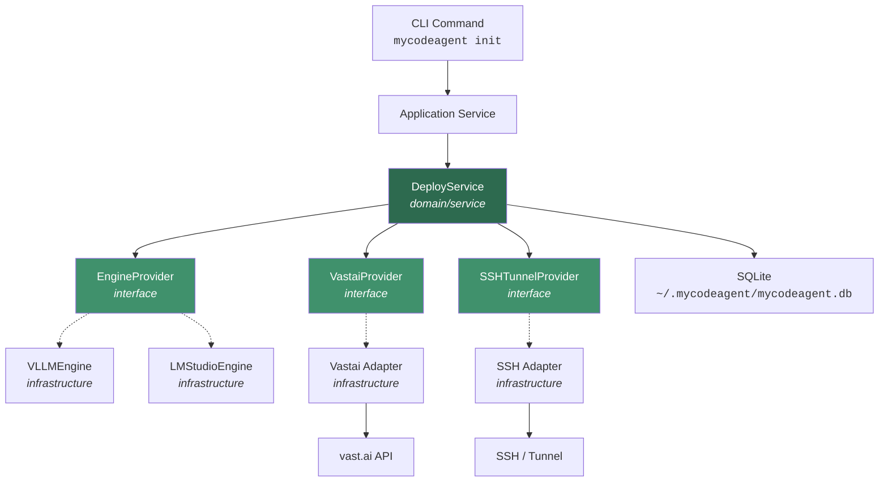
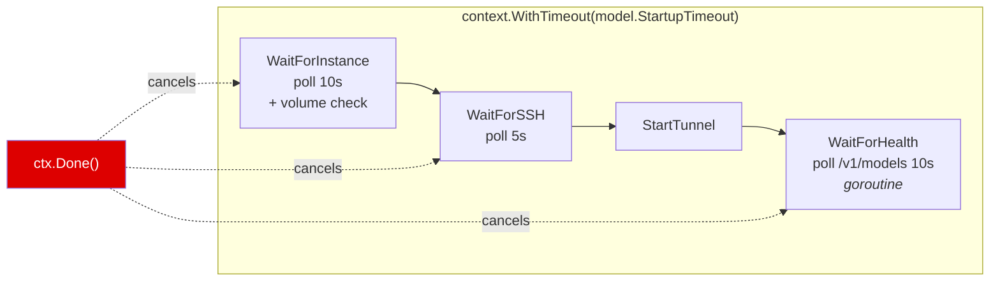
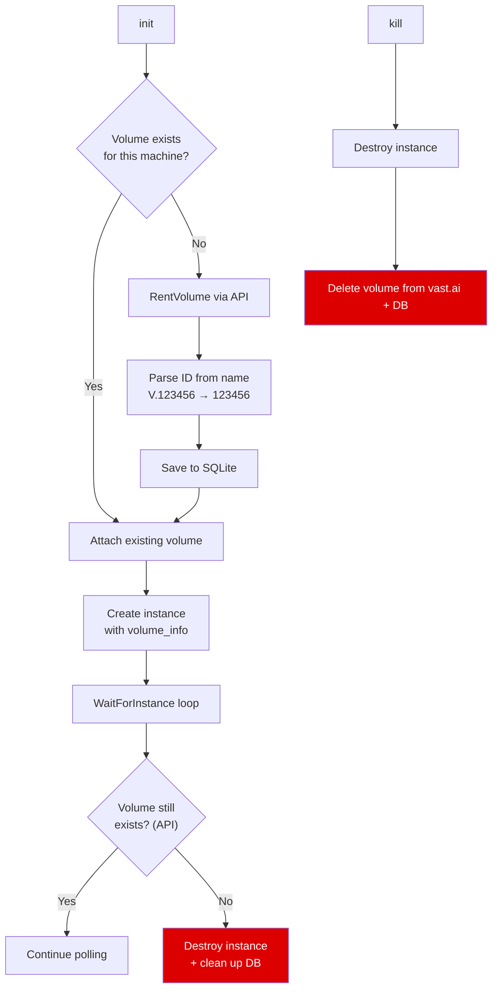
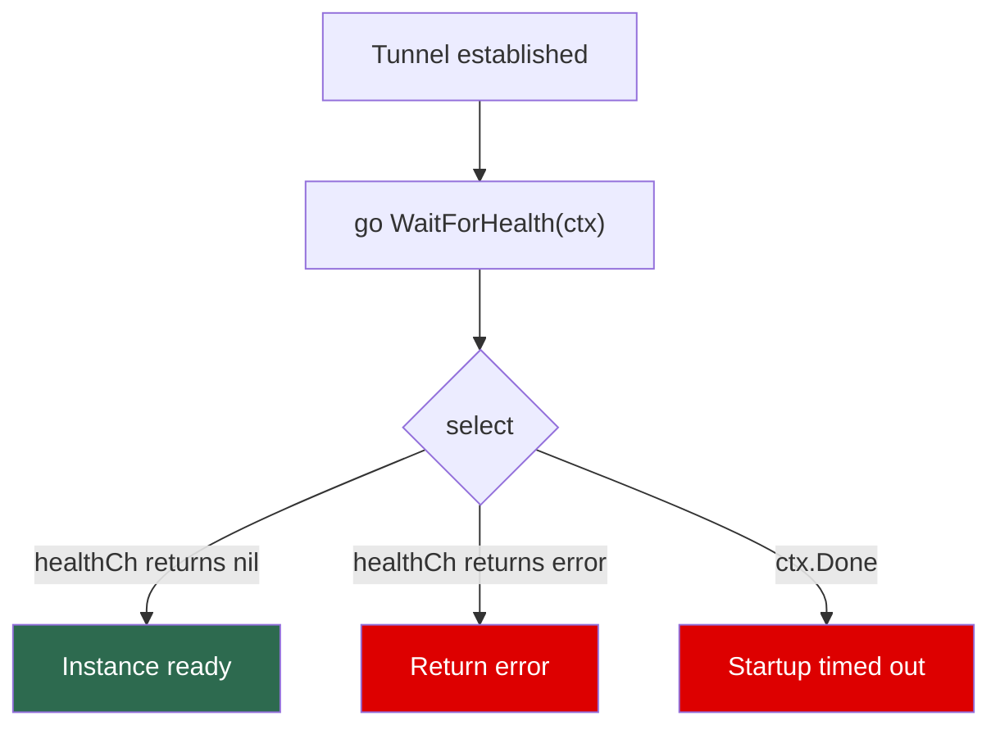
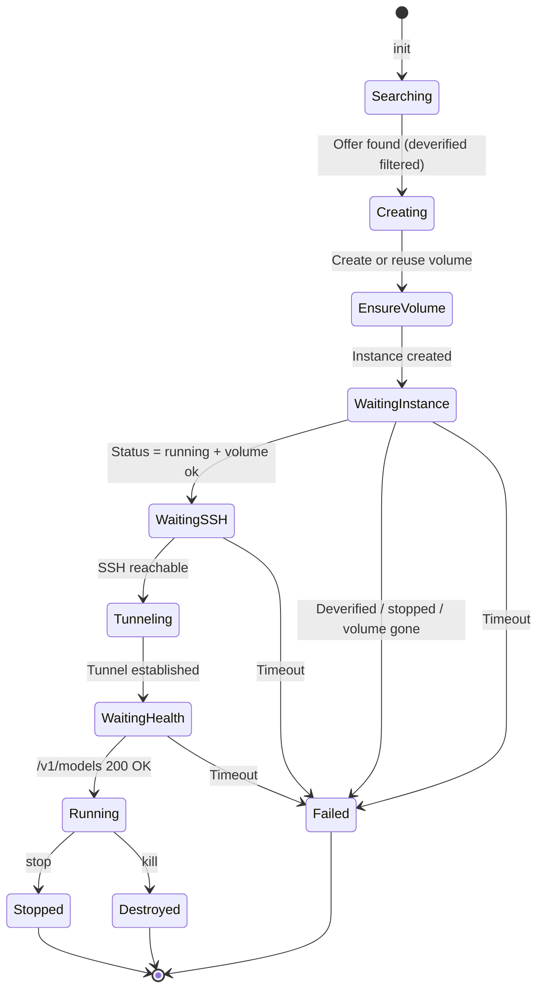
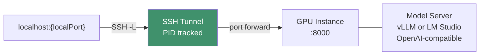

# Solution: Instance Deployment Logic

## Overview

`mycodeagent init <model>` deploys a model on a vast.ai GPU instance and exposes it as an OpenAI-compatible API on localhost. Models can run via **vLLM** or **LM Studio** engines. The entire startup is governed by a single `context.Context` with a per-model timeout (default 10 min, up to 20 min for multi-GPU models).

## Architecture Layers



Dependencies point inward: Infrastructure implements Domain interfaces. Domain has zero external imports.

### Engine Provider Pattern

The `EngineProvider` interface abstracts engine-specific deployment details:

```go
type EngineProvider interface {
    DockerImage() string
    BuildOnstart(model *entity.Model, hfToken string) string
    BuildRawCommand(model *entity.Model) string
    VolumeMountPath() string
    RestartCommands(model *entity.Model) (killCmd string, startCmd string)
}
```

Two implementations:

| Engine | Docker Image | Model Format | Server Port |
|---|---|---|---|
| **VLLMEngine** | `vllm/vllm-openai:v0.19.0` | HuggingFace (AWQ/FP16) | 8000 |
| **LMStudioEngine** | `nvidia/cuda:12.4.1-runtime-ubuntu22.04` | GGUF via `lms get` | 8000 |

## Deploy Flow

```mermaid
sequenceDiagram
    participant User
    participant CLI
    participant DeployService
    participant EngineProvider
    participant VastaiProvider
    participant SSHTunnelProvider
    participant VastAI as vast.ai API
    participant Remote as GPU Instance

    User->>CLI: mycodeagent init <model>
    CLI->>DeployService: Deploy(modelName)

    Note over DeployService: Create context with<br/>model.StartupTimeout

    DeployService->>DeployService: Resolve model profile
    DeployService->>EngineProvider: BuildOnstart(model, hfToken)
    EngineProvider-->>DeployService: onstart script
    DeployService->>VastaiProvider: SearchOffers(VRAM, numGPUs)
    VastaiProvider->>VastAI: GET /bundles (search, filter deverified)
    VastAI-->>VastaiProvider: Sorted offers
    VastaiProvider-->>DeployService: Cheapest offer

    DeployService->>DeployService: ensureVolume(offer, mountPath)
    DeployService->>VastaiProvider: CreateInstance(offerID, image, env, onstart, volumeID)
    VastaiProvider->>VastAI: PUT /asks/{id}
    VastAI-->>VastaiProvider: instanceID
    VastaiProvider-->>DeployService: instanceID

    rect rgb(50, 50, 80)
        Note over DeployService,Remote: All waits share one context (timeout)
        DeployService->>VastaiProvider: WaitForInstance(ctx, instanceID, volumeID)
        loop Poll every 10s until "running"
            VastaiProvider->>VastAI: GET /instances/{id}
            Note over VastaiProvider: Check: deverified? stopped?<br/>volume still exists?
            VastAI-->>VastaiProvider: status + volume check
        end
        VastaiProvider-->>DeployService: sshHost, sshPort, rate

        DeployService->>SSHTunnelProvider: WaitForSSH(ctx, host, port)
        loop Dial TCP every 5s
            SSHTunnelProvider->>Remote: TCP connect
        end
        SSHTunnelProvider-->>DeployService: SSH ready

        DeployService->>SSHTunnelProvider: FindFreePort(basePort)
        SSHTunnelProvider-->>DeployService: localPort

        DeployService->>SSHTunnelProvider: StartTunnel(localPort, host, port)
        SSHTunnelProvider-->>DeployService: tunnelPID

        DeployService->>SSHTunnelProvider: WaitForHealth(ctx, localPort)
        Note over SSHTunnelProvider: Runs in goroutine
        loop GET /v1/models every 10s
            SSHTunnelProvider->>Remote: HTTP localhost:localPort/v1/models
        end
        SSHTunnelProvider-->>DeployService: Healthy (or ctx timeout)
    end

    DeployService->>DeployService: Save instance to SQLite
    DeployService-->>CLI: Instance
    CLI-->>User: API available at localhost:{port}/v1
```



## Timeout Strategy

A single `context.WithTimeout` wraps the entire startup sequence. Each wait phase consumes from the same deadline -- if an earlier phase is slow, later phases have less time, and the whole flow fails cleanly on expiry.



### Per-Model Timeouts

| Model | Alias | Engine | GPUs | Timeout |
|---|---|---|---|---|
| `qwen3-5-35b-a3b-awq` | coder | vLLM | 2x GPU (24 GB) | 20 min |
| `qwen3-vl-32b-instruct-awq` | coder_vl | vLLM | 2x GPU | 15 min |
| `qwen25-32b-instruct-awq` | writer | vLLM | 2x GPU | 15 min |
| `dolphin-glm-24b` | rude | vLLM | 2x GPU | 15 min |
| `qwen25-coder-32b-gguf` | coder-2 | LM Studio | 1x GPU (24 GB) | 15 min |

Bigger models (multi-GPU, larger downloads) get longer timeouts. If `StartupTimeout` is unset, the default is **10 minutes**.

## Volume Management

Volumes provide persistent storage for model caching across instance restarts.



- Volumes are created per-machine and tracked in SQLite (`volume_id` on instance)
- `volume list` calls `GET /api/v0/volumes/` and removes stale local records
- `kill` destroys both the instance and its associated volume
- During `WaitForInstance`, volume existence is verified on each poll; if gone, instance is destroyed

## Health Check

The health check polls `GET /v1/models` (works for both vLLM and LM Studio) in a background goroutine:



## Instance Lifecycle



## SSH Tunnel Detail



- Each `init` allocates a new local port (starting from `basePort`, scanning +100)
- Tunnel runs as a background `ssh -N -L` process; PID saved to SQLite
- `stop` sends SIGTERM to the tunnel PID, then stops the vast.ai instance
- `kill` destroys the instance, its tunnel, and associated volume
- `restart` regenerates the onstart script on the instance and restarts the server
